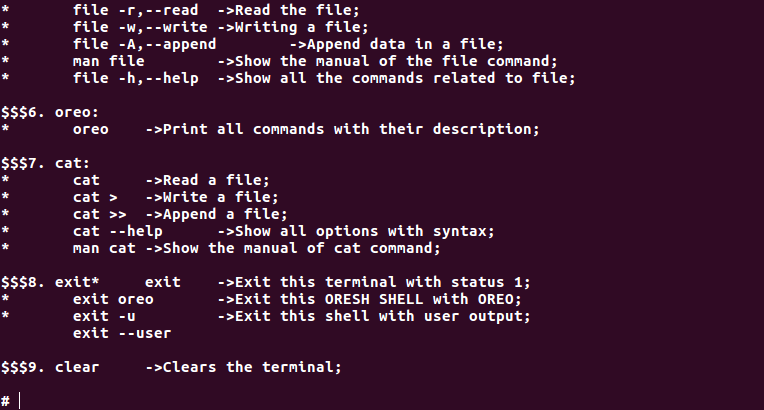
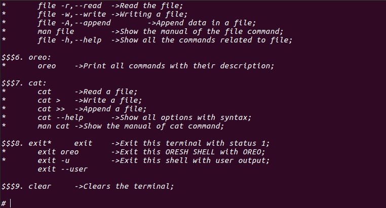
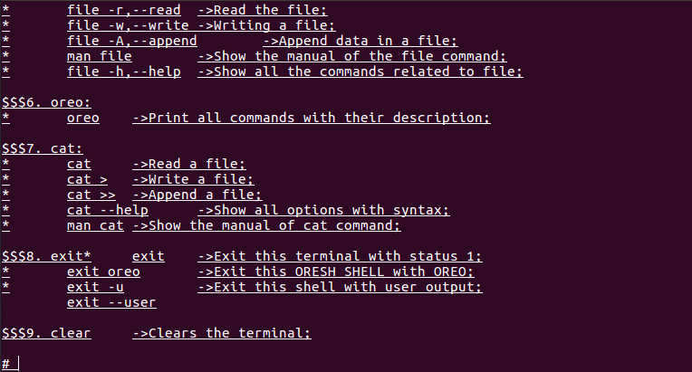
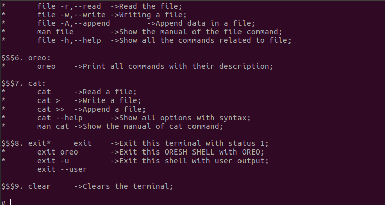
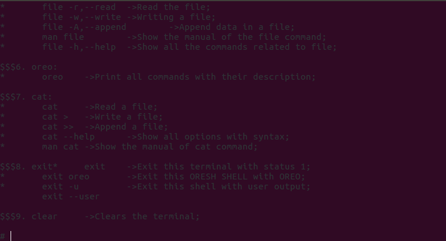
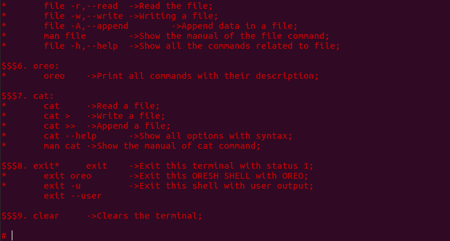
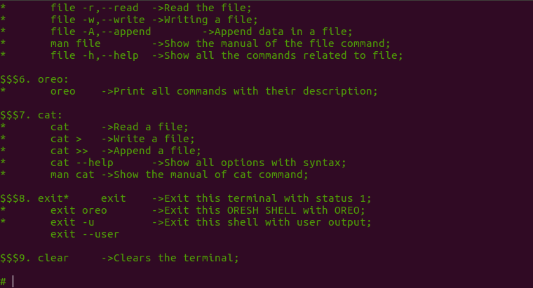
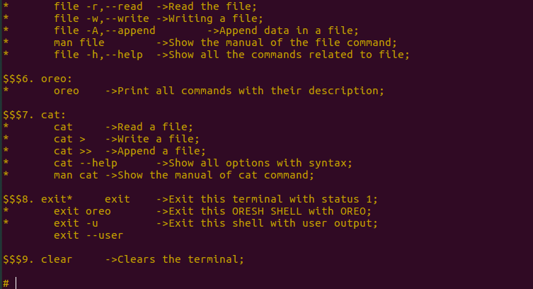
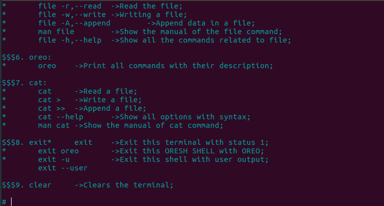
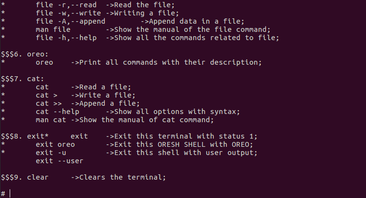

# SHOWING OUTPUT AND USAGE CONSTANT OF COLORS

## FORMATTING TEXT

 USED VARIABLE | COLOR CODE | OUTPUT
---------------|------------|--------------
 RESET | "\x1B[0m" | RESET NORMAL
 BOLD | "\x1B[1m" | BOLD WHITE
 ITALIC | "\x1B[3m" | ITALIC TEXT
 UNDERLINE | "\x1B[4m" | UNDERLINE TEXT

### OUTPUT

#### RESET

#### BOLD

#### ITALIC

#### UNDERLINE

## TEXT COLORS

 USED VARIABLE | COLOR CODE | OUTPUT COLOR
---------------|------------|--------------
 green | "\x1B[2m" | green
 BLACK | "\x1B[30m" | BLACK
 RED | "\x1B[31m" | RED
 GREEN | "\x1B[32m" | GREEN
 YELLOW | "\x1B[33m" | YELLOW
 BLUE | "\x1B[34m" | BLUE
 MAGENTA | "\x1B[35m" | MAGENTA
 CYAN | "\x1B[36m" | CYAN
 WHITE | "\x1B[37m" | WHITE

### OUTPUT

#### green

#### BLACK

#### RED

#### GREEN

#### YELLOW

#### BLUE

#### MAGENTA

#### CYAN

#### WHITE

## BACKGROUND COLORS

 USED VARIABLE | COLOR CODE | OUTPUT BACKGROUND
---------------|------------|------------------
 BGGREENISH | "\x1B[40m" | GREENISH BG
 BGRED | "\x1B[41m" | RED BG
 BGLGREEN | "\x1B[42m" | LIGHT GREEN BG
 BGORANGE | "\x1B[43m" | ORANGE BG
 BGLBLUE  | "\x1B[44m" | LIGHT BLUE BG
 BGPINK | "\x1B[45m" | PINK BG
 BGDGREEN | "\x1B[46m" | DARK GREEN BG
 BGWHITE | "\x1B[47m" | WHITE-GREEN BG

### OUTPUT

#### BGGREENISH

#### BGRED

#### BGLGREEN

#### BGORANGE

#### BGLBLUE

#### BGPINK

#### BGDGREEN

#### BGWHITE

## CUSTOMIZATION

1. [FORMATTING COLORS](formattingcolors.md)
2. [FORMATTING BACKGROUND](formattingbg.md)
