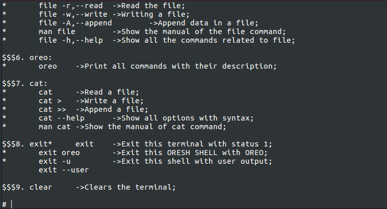

# BACKGROUND COLORS

 USED VARIABLE | COLOR CODE FOR C/C++ | COLOR CODE FOR JAVA | OUTPUT BACKGROUND
---------------|----------------------|---------------------|-------------------
 BGGREEN | \x1B[40m | \u001B[40m | [GREEN BG](#rocket-BBGREEN)
 BGRED | \x1B[41m | \u001B[41m | [RED BG](#rocket-BGRED)
 BGLGREEN | \x1B[42m | \u001B[42m | [LIGHT GREEN BG](#rocket-BGLGREEN)
 BGORANGE | \x1B[43m | \u001B[43m | [ORANGE BG](#rocket-BGORANGE)
 BGLBLUE  | \x1B[44m | \u001B[44m | [LIGHT BLUE BG](#rocket-BGLBLUE)
 BGPINK | \x1B[45m | \u001B[45m | [PINK BG](#rocket-BGPINK)
 BGDGREEN | \x1B[46m | \u001B[46m | [DARK GREEN BG](#rocket-BGDGREEN)
 BGWHITE | \x1B[47m | \u001B[47m | [WHITE-GREEN BG](#rocket-BGWHITE)

## OUTPUT

### :rocket: BGGREEN

### :rocket: BGRED

### :rocket: BGLGREEN

### :rocket: BGORANGE

### :rocket: BGLBLUE

### :rocket: BGPINK

### :rocket: BGDGREEN

### :rocket: BGWHITE

