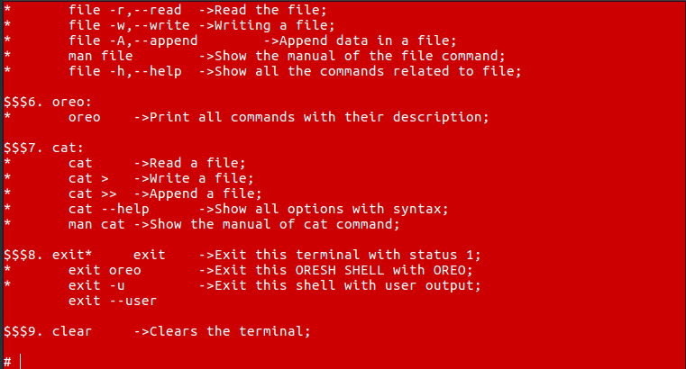
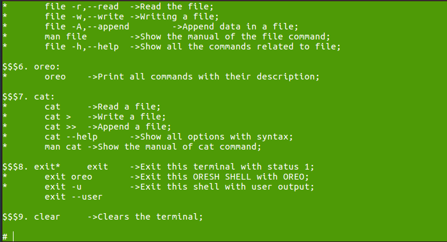
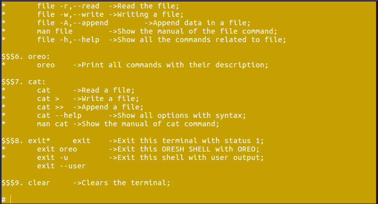
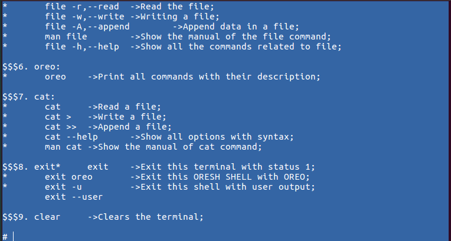
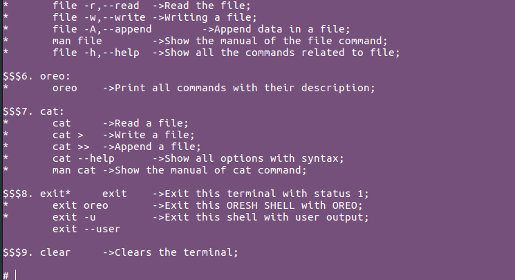
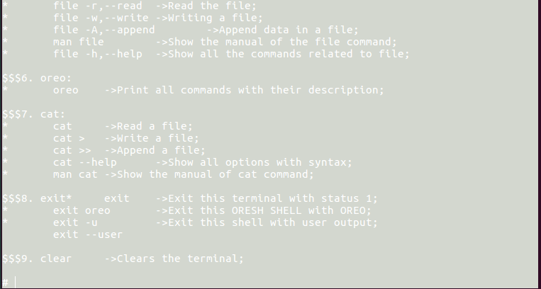

# BACKGROUND COLORS

 USED VARIABLE | COLOR CODE | OUTPUT BACKGROUND
---------------|------------|------------------
 BGGREEN | "\x1B[40m" | GREEN BG
 BGRED | "\x1B[41m" | RED BG
 BGLGREEN | "\x1B[42m" | LIGHT GREEN BG
 BGORANGE | "\x1B[43m" | ORANGE BG
 BGLBLUE  | "\x1B[44m" | LIGHT BLUE BG
 BGPINK | "\x1B[45m" | PINK BG
 BGDGREEN | "\x1B[46m" | DARK GREEN BG
 BGWHITE | "\x1B[47m" | WHITE-GREEN BG

## OUTPUT

### :rocket: BGGREEN

### :rocket: BGRED

### :rocket: BGLGREEN

### :rocket: BGORANGE

### :rocket: BGLBLUE

### :rocket: BGPINK

### :rocket: BGDGREEN

### :rocket: BGWHITE

