# COLORED TEXTS WITH BACKGROUNDS

## LGREEN

 USED VARIABLE | COLOR CODE FOR C/C++ | COLOR CODE FOR JAVA | OUTPUT
---------------|----------------------|---------------------|--------
 LGREEN_BGDGREEN | \x1B[32;40m | \u001B[32;40m | [normal text](#output-lgreen)
 LGREEN_BGLGREEN | \x1B[32;42m | \u001B[32;42m | [normal text](#output-lgreen)
 LGREEN_BGMGREEN | \x1B[32;100m | \u001B[32;100m | [normal text](#output-lgreen)
 LGREEN_BGDRED | \x1B[32;41m | \u001B[32;41m | [normal text](#output-lgreen)
 LGREEN_BGLRED | \x1B[32;101m | \u001B[32;101m | [normal text](#output-lgreen)
 LGREEN_BGDORANGE | \x1B[32;43m | \u001B[32;43m | [normal text](#output-lgreen)
 LGREEN_BGLORANGE | \x1B[32;102m | \u001B[32;102m | [normal text](#output-lgreen)
 LGREEN_BGLBLUE | \x1B[32;44m | \u001B[32;44m | [normal text](#output-lgreen)
 LGREEN_BGLWHITE | \x1B[32;47m | \u001B[32;47m | [normal text](#output-lgreen)
 LGREEN_BGDWHITE | \x1B[32;107m | \u001B[32;107m | [normal text](#output-lgreen)
 LGREEN_BGLEMON | \x1B[32;103m | \u001B[32;103m | [normal text](#output-lgreen)
 LGREEN_BGMPINK | \x1B[32;104m | \u001B[32;104m | [normal text](#output-lgreen)
 LGREEN_BGDPINK | \x1B[32;105m | \u001B[32;105m | [normal text](#output-lgreen)
 LGREEN_BGLPINK | \x1B[32;106m | \u001B[32;106m | [normal text](#output-lgreen)

### OUTPUT LGREEN

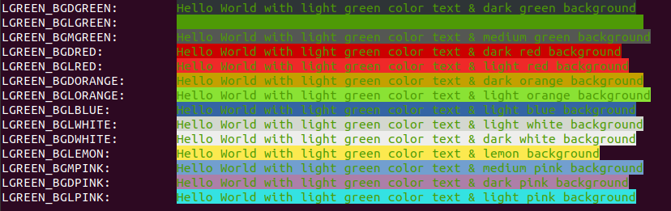

## MGREEN

 USED VARIABLE | COLOR CODE FOR C/C++ | COLOR CODE FOR JAVA | OUTPUT
---------------|----------------------|---------------------|--------
 MGREEN_BGDGREEN | \x1B[2;40m | \u001B[2;40m | [normal text](#output-mgreen)
 MGREEN_BGLGREEN | \x1B[2;42m | \u001B[2;42m | [normal text](#output-mgreen)
 MGREEN_BGMGREEN | \x1B[2;100m | \u001B[2;100m | [normal text](#output-mgreen)
 MGREEN_BGDRED | \x1B[2;41m | \u001B[2;41m | [normal text](#output-mgreen)
 MGREEN_BGLRED | \x1B[2;101m | \u001B[2;101m | [normal text](#output-mgreen)
 MGREEN_BGDORANGE | \x1B[2;43m | \u001B[2;43m | [normal text](#output-mgreen)
 MGREEN_BGLORANGE | \x1B[2;102m | \u001B[2;102m | [normal text](#output-mgreen)
 MGREEN_BGLBLUE | \x1B[2;44m | \u001B[2;44m | [normal text](#output-mgreen)
 MGREEN_BGLWHITE | \x1B[2;47m | \u001B[2;47m | [normal text](#output-mgreen)
 MGREEN_BGDWHITE | \x1B[2;107m | \u001B[2;107m | [normal text](#output-mgreen)
 MGREEN_BGLEMON | \x1B[2;103m | \u001B[2;103m | [normal text](#output-mgreen)
 MGREEN_BGMPINK | \x1B[2;104m | \u001B[2;104m | [normal text](#output-mgreen)
 MGREEN_BGDPINK | \x1B[2;105m | \u001B[2;105m | [normal text](#output-mgreen)
 MGREEN_BGLPINK | \x1B[2;106m | \u001B[2;106m | [normal text](#output-mgreen)

### OUTPUT MGREEN

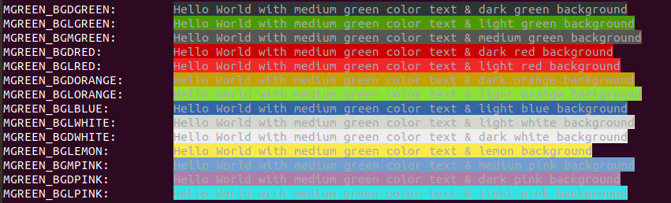

## DGREEN

 USED VARIABLE | COLOR CODE FOR C/C++ | COLOR CODE FOR JAVA | OUTPUT
---------------|----------------------|---------------------|--------
 DGREEN_BGDGREEN | \x1B[90;40m | \u001B[90;40m | [normal text](#output-dgreen)
 DGREEN_BGLGREEN | \x1B[90;42m | \u001B[90;42m | [normal text](#output-dgreen)
 DGREEN_BGMGREEN | \x1B[90;100m | \u001B[90;100m | [normal text](#output-dgreen)
 DGREEN_BGDRED | \x1B[90;41m | \u001B[90;41m | [normal text](#output-dgreen)
 DGREEN_BGLRED | \x1B[90;101m | \u001B[90;101m | [normal text](#output-dgreen)
 DGREEN_BGDORANGE | \x1B[90;43m | \u001B[90;43m | [normal text](#output-dgreen)
 DGREEN_BGLORANGE | \x1B[90;102m | \u001B[90;102m | [normal text](#output-dgreen)
 DGREEN_BGLBLUE | \x1B[90;44m | \u001B[90;44m | [normal text](#output-dgreen)
 DGREEN_BGLWHITE | \x1B[90;47m | \u001B[90;47m | [normal text](#output-dgreen)
 DGREEN_BGDWHITE | \x1B[90;107m | \u001B[90;107m | [normal text](#output-dgreen)
 DGREEN_BGLEMON | \x1B[90;103m | \u001B[90;103m | [normal text](#output-dgreen)
 DGREEN_BGMPINK | \x1B[90;104m | \u001B[90;104m | [normal text](#output-dgreen)
 DGREEN_BGDPINK | \x1B[90;105m | \u001B[90;105m | [normal text](#output-dgreen)
 DGREEN_BGLPINK | \x1B[90;106m | \u001B[90;106m | [normal text](#output-dgreen)

### OUTPUT DGREEN

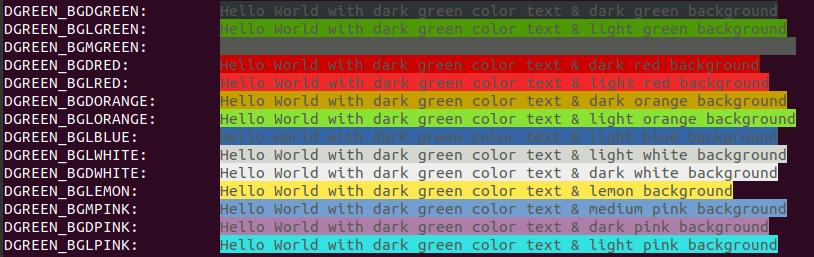

## LRED

 USED VARIABLE | COLOR CODE FOR C/C++ | COLOR CODE FOR JAVA | OUTPUT
---------------|----------------------|---------------------|--------
 LRED_BGDGREEN  | \x1B[91;40m | \u001B[91;40m | [normal text](#output-lred)
 LRED_BGLGREEN  | \x1B[91;42m | \u001B[91;42m | [normal text](#output-lred)
 LRED_BGMGREEN  | \x1B[91;100m | \u001B[91;100m | [normal text](#output-lred)
 LRED_BGDRED  | \x1B[91;41m | \u001B[91;41m | [normal text](#output-lred)
 LRED_BGLRED  | \x1B[91;101m | \u001B[91;101m | [normal text](#output-lred)
 LRED_BGDORANGE  | \x1B[91;43m | \u001B[91;43m | [normal text](#output-lred)
 LRED_BGLORANGE  | \x1B[91;102m | \u001B[91;102m | [normal text](#output-lred)
 LRED_BGLBLUE  | \x1B[91;44m | \u001B[91;44m | [normal text](#output-lred)
 LRED_BGLWHITE  | \x1B[91;47m | \u001B[91;47m | [normal text](#output-lred)
 LRED_BGDWHITE  | \x1B[91;107m | \u001B[91;107m | [normal text](#output-lred)
 LRED_BGLEMON  | \x1B[91;103m | \u001B[91;103m | [normal text](#output-lred)
 LRED_BGMPINK  | \x1B[91;104m | \u001B[91;104m | [normal text](#output-lred)
 LRED_BGDPINK  | \x1B[91;105m | \u001B[91;105m | [normal text](#output-lred)
 LRED_BGLPINK  | \x1B[91;106m | \u001B[91;106m | [normal text](#output-lred)

### OUTPUT LRED

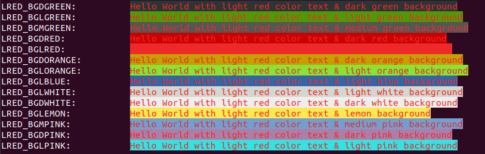

## DRED

 USED VARIABLE | COLOR CODE FOR C/C++ | COLOR CODE FOR JAVA | OUTPUT
---------------|----------------------|---------------------|--------
 DRED_BGDGREEN | \x1B[31;40m | \u001B[31;40m | [normal text](#output-dred)
 DRED_BGLGREEN | \x1B[31;42m | \u001B[31;42m | [normal text](#output-dred)
 DRED_BGMGREEN | \x1B[31;100m | \u001B[31;100m | [normal text](#output-dred)
 DRED_BGDRED | \x1B[31;41m | \u001B[31;41m | [normal text](#output-dred)
 DRED_BGLRED | \x1B[31;101m | \u001B[31;101m | [normal text](#output-dred)
 DRED_BGDORANGE | \x1B[31;43m | \u001B[31;43m | [normal text](#output-dred)
 DRED_BGLORANGE | \x1B[31;102m | \u001B[31;102m | [normal text](#output-dred)
 DRED_BGLBLUE | \x1B[31;44m | \u001B[31;44m | [normal text](#output-dred)
 DRED_BGLWHITE | \x1B[31;47m | \u001B[31;47m | [normal text](#output-dred)
 DRED_BGDWHITE | \x1B[31;107m | \u001B[31;107m | [normal text](#output-dred)
 DRED_BGLEMON | \x1B[31;103m | \u001B[31;103m | [normal text](#output-dred)
 DRED_BGMPINK | \x1B[31;104m | \u001B[31;104m | [normal text](#output-dred)
 DRED_BGDPINK | \x1B[31;105m | \u001B[31;105m | [normal text](#output-dred)
 DRED_BGLPINK | \x1B[31;106m | \u001B[31;106m | [normal text](#output-dred)

### OUTPUT DRED

## LWHITE

 USED VARIABLE | COLOR CODE FOR C/C++ | COLOR CODE FOR JAVA | OUTPUT
---------------|----------------------|---------------------|--------
 LWHITE_BGDGREEN | \x1B[37;40m | \u001B[37;40m | [normal text](#output-lwhite)
 LWHITE_BGLGREEN | \x1B[37;42m | \u001B[37;42m | [normal text](#output-lwhite)
 LWHITE_BGMGREEN | \x1B[37;100m | \u001B[37;100m | [normal text](#output-lwhite)
 LWHITE_BGDRED | \x1B[37;41m | \u001B[37;41m | [normal text](#output-lwhite)
 LWHITE_BGLRED | \x1B[37;101m | \u001B[37;101m | [normal text](#output-lwhite)
 LWHITE_BGDORANGE | \x1B[37;43m | \u001B[37;43m | [normal text](#output-lwhite)
 LWHITE_BGLORANGE | \x1B[37;102m | \u001B[37;102m | [normal text](#output-lwhite)
 LWHITE_BGLBLUE | \x1B[37;44m | \u001B[37;44m | [normal text](#output-lwhite)
 LWHITE_BGLWHITE | \x1B[37;47m | \u001B[37;47m | [normal text](#output-lwhite)
 LWHITE_BGDWHITE | \x1B[37;107m | \u001B[37;107m | [normal text](#output-lwhite)
 LWHITE_BGLEMON | \x1B[37;103m | \u001B[37;103m | [normal text](#output-lwhite)
 LWHITE_BGMPINK | \x1B[37;104m | \u001B[37;104m | [normal text](#output-lwhite)
 LWHITE_BGDPINK | \x1B[37;105m | \u001B[37;105m | [normal text](#output-lwhite)
 LWHITE_BGLPINK | \x1B[37;106m | \u001B[37;106m | [normal text](#output-lwhite)

### OUTPUT LWHITE

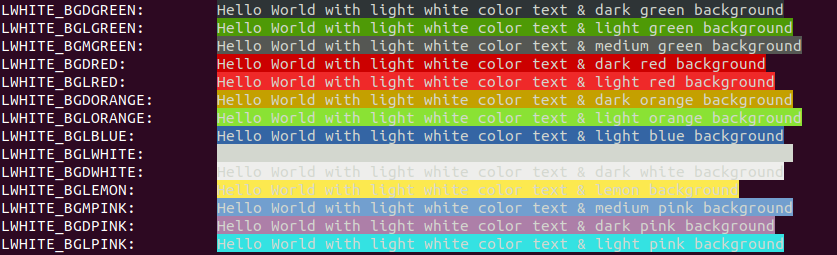

## DWHITE

 USED VARIABLE | COLOR CODE FOR C/C++ | COLOR CODE FOR JAVA | OUTPUT
---------------|----------------------|---------------------|--------
 DWHITE_BGDGREEN | \x1B[97;40m | \u001B[97;40m | [normal text](#output-dwhite)
 DWHITE_BGLGREEN | \x1B[97;42m | \u001B[97;42m | [normal text](#output-dwhite)
 DWHITE_BGMGREEN | \x1B[97;100m | \u001B[97;100m | [normal text](#output-dwhite)
 DWHITE_BGDRED | \x1B[97;41m | \u001B[97;41m | [normal text](#output-dwhite)
 DWHITE_BGLRED | \x1B[97;101m | \u001B[97;101m | [normal text](#output-dwhite)
 DWHITE_BGDORANGE | \x1B[97;43m | \u001B[97;43m | [normal text](#output-dwhite)
 DWHITE_BGLORANGE | \x1B[97;102m | \u001B[97;102m | [normal text](#output-dwhite)
 DWHITE_BGLBLUE | \x1B[97;44m | \u001B[97;44m | [normal text](#output-dwhite)
 DWHITE_BGLWHITE | \x1B[97;47m | \u001B[97;47m | [normal text](#output-dwhite)
 DWHITE_BGDWHITE | \x1B[97;107m | \u001B[97;107m | [normal text](#output-dwhite)
 DWHITE_BGLEMON | \x1B[97;103m | \u001B[97;103m | [normal text](#output-dwhite)
 DWHITE_BGMPINK | \x1B[97;104m | \u001B[97;104m | [normal text](#output-dwhite)
 DWHITE_BGDPINK | \x1B[97;105m | \u001B[97;105m | [normal text](#output-dwhite)
 DWHITE_BGLPINK | \x1B[97;106m | \u001B[97;106m | [normal text](#output-dwhite)

### OUTPUT DWHITE

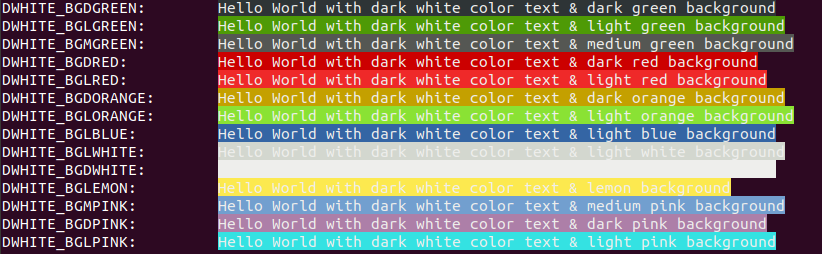

## LBLUE

 USED VARIABLE | COLOR CODE FOR C/C++ | COLOR CODE FOR JAVA | OUTPUT
---------------|----------------------|---------------------|--------
 LBLUE_BGDGREEN | \x1B[94;40m | \u001B[94;40m | [normal text](#output-lblue)
 LBLUE_BGLGREEN | \x1B[94;42m | \u001B[94;42m | [normal text](#output-lblue)
 LBLUE_BGMGREEN | \x1B[94;100m | \u001B[94;100m | [normal text](#output-lblue)
 LBLUE_BGDRED | \x1B[94;41m | \u001B[94;41m | [normal text](#output-lblue)
 LBLUE_BGLRED | \x1B[94;101m | \u001B[94;101m | [normal text](#output-lblue)
 LBLUE_BGDORANGE | \x1B[94;43m | \u001B[94;43m | [normal text](#output-lblue)
 LBLUE_BGLORANGE | \x1B[94;102m | \u001B[94;102m | [normal text](#output-lblue)
 LBLUE_BGLBLUE | \x1B[94;44m | \u001B[94;44m | [normal text](#output-lblue)
 LBLUE_BGLWHITE | \x1B[94;47m | \u001B[94;47m | [normal text](#output-lblue)
 LBLUE_BGDWHITE | \x1B[94;107m | \u001B[94;107m | [normal text](#output-lblue)
 LBLUE_BGLEMON | \x1B[94;103m | \u001B[94;103m | [normal text](#output-lblue)
 LBLUE_BGMPINK | \x1B[94;104m | \u001B[94;104m | [normal text](#output-lblue)
 LBLUE_BGDPINK | \x1B[94;105m | \u001B[94;105m | [normal text](#output-lblue)
 LBLUE_BGLPINK | \x1B[94;106m | \u001B[94;106m | [normal text](#output-lblue)

### OUTPUT LBLUE

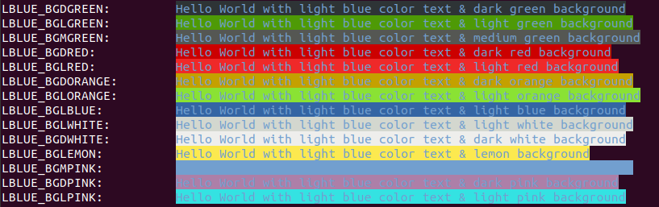

## DBLUE

 USED VARIABLE | COLOR CODE FOR C/C++ | COLOR CODE FOR JAVA | OUTPUT
---------------|----------------------|---------------------|--------
 DBLUE_BGDGREEN | \x1B[34;40m | \u001B[34;40m | [normal text](#output-dblue)
 DBLUE_BGLGREEN | \x1B[34;42m | \u001B[34;42m | [normal text](#output-dblue)
 DBLUE_BGMGREEN | \x1B[34;100m | \u001B[34;100m | [normal text](#output-dblue)
 DBLUE_BGDRED | \x1B[34;41m | \u001B[34;41m | [normal text](#output-dblue)
 DBLUE_BGLRED | \x1B[34;101m | \u001B[34;101m | [normal text](#output-dblue)
 DBLUE_BGDORANGE | \x1B[34;43m | \u001B[34;43m | [normal text](#output-dblue)
 DBLUE_BGLORANGE | \x1B[34;102m | \u001B[34;102m | [normal text](#output-dblue)
 DBLUE_BGLBLUE | \x1B[34;44m | \u001B[34;44m | [normal text](#output-dblue)
 DBLUE_BGLWHITE | \x1B[34;47m | \u001B[34;47m | [normal text](#output-dblue)
 DBLUE_BGDWHITE | \x1B[34;107m | \u001B[34;107m | [normal text](#output-dblue)
 DBLUE_BGLEMON | \x1B[34;103m | \u001B[34;103m | [normal text](#output-dblue)
 DBLUE_BGMPINK | \x1B[34;104m | \u001B[34;104m | [normal text](#output-dblue)
 DBLUE_BGDPINK | \x1B[34;105m | \u001B[34;105m | [normal text](#output-dblue)
 DBLUE_BGLPINK | \x1B[34;106m | \u001B[34;106m | [normal text](#output-dblue)

### OUTPUT DBLUE

  

## LCYAN

 USED VARIABLE | COLOR CODE FOR C/C++ | COLOR CODE FOR JAVA | OUTPUT
---------------|----------------------|---------------------|--------
 LCYAN_BGDGREEN | \x1B[96;40m | \u001B[96;40m | [normal text](#output-lcyan)
 LCYAN_BGLGREEN | \x1B[96;42m | \u001B[96;42m | [normal text](#output-lcyan)
 LCYAN_BGMGREEN | \x1B[96;100m | \u001B[96;100m | [normal text](#output-lcyan)
 LCYAN_BGDRED | \x1B[96;41m | \u001B[96;41m | [normal text](#output-lcyan)
 LCYAN_BGLRED | \x1B[96;101m | \u001B[96;101m | [normal text](#output-lcyan)
 LCYAN_BGDORANGE | \x1B[96;43m | \u001B[96;43m | [normal text](#output-lcyan)
 LCYAN_BGLORANGE | \x1B[96;102m | \u001B[96;102m | [normal text](#output-lcyan)
 LCYAN_BGLBLUE | \x1B[96;44m | \u001B[96;44m | [normal text](#output-lcyan)
 LCYAN_BGLWHITE | \x1B[96;47m | \u001B[96;47m | [normal text](#output-lcyan)
 LCYAN_BGDWHITE | \x1B[96;107m | \u001B[96;107m | [normal text](#output-lcyan)
 LCYAN_BGLEMON | \x1B[96;103m | \u001B[96;103m | [normal text](#output-lcyan)
 LCYAN_BGMPINK | \x1B[96;104m | \u001B[96;104m | [normal text](#output-lcyan)
 LCYAN_BGDPINK | \x1B[96;105m | \u001B[96;105m | [normal text](#output-lcyan)
 LCYAN_BGLPINK | \x1B[96;106m | \u001B[96;106m | [normal text](#output-lcyan)

### OUTPUT LCYAN

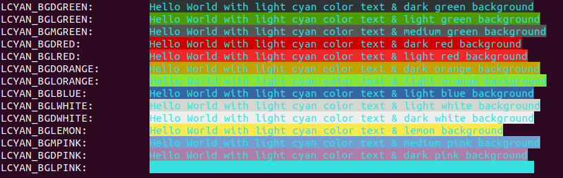

## DCYAN

 USED VARIABLE | COLOR CODE FOR C/C++ | COLOR CODE FOR JAVA | OUTPUT
---------------|----------------------|---------------------|--------
 DCYAN_BGDGREEN | \x1B[36;40m | \u001B[36;40m | [normal text](#output-dcyan)
 DCYAN_BGLGREEN | \x1B[36;42m | \u001B[36;42m | [normal text](#output-dcyan)
 DCYAN_BGMGREEN | \x1B[36;100m | \u001B[36;100m | [normal text](#output-dcyan)
 DCYAN_BGDRED | \x1B[36;41m | \u001B[36;41m | [normal text](#output-dcyan)
 DCYAN_BGLRED | \x1B[36;101m | \u001B[36;101m | [normal text](#output-dcyan)
 DCYAN_BGDORANGE | \x1B[36;43m | \u001B[36;43m | [normal text](#output-dcyan)
 DCYAN_BGLORANGE | \x1B[36;102m | \u001B[36;102m | [normal text](#output-dcyan)
 DCYAN_BGLBLUE | \x1B[36;44m | \u001B[36;44m | [normal text](#output-dcyan)
 DCYAN_BGLWHITE | \x1B[36;47m | \u001B[36;47m | [normal text](#output-dcyan)
 DCYAN_BGDWHITE | \x1B[36;107m | \u001B[36;107m | [normal text](#output-dcyan)
 DCYAN_BGLEMON | \x1B[36;103m | \u001B[36;103m | [normal text](#output-dcyan)
 DCYAN_BGMPINK | \x1B[36;104m | \u001B[36;104m | [normal text](#output-dcyan)
 DCYAN_BGDPINK | \x1B[36;105m | \u001B[36;105m | [normal text](#output-dcyan)
 DCYAN_BGLPINK | \x1B[36;106m | \u001B[36;106m | [normal text](#output-dcyan)

### OUTPUT DCYAN

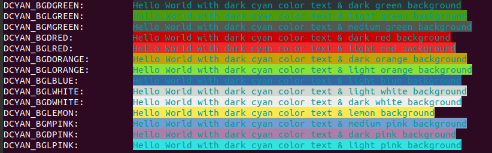

## ORANGE

 USED VARIABLE | COLOR CODE FOR C/C++ | COLOR CODE FOR JAVA | OUTPUT
---------------|----------------------|---------------------|--------
 ORANGE_BGDGREEN | \x1B[33;40m | \u001B[33;40m | [normal text](#output-orange)
 ORANGE_BGLGREEN | \x1B[33;42m | \u001B[33;42m | [normal text](#output-orange)
 ORANGE_BGMGREEN | \x1B[33;100m | \u001B[33;100m | [normal text](#output-orange)
 ORANGE_BGDRED | \x1B[33;41m | \u001B[33;41m | [normal text](#output-orange)
 ORANGE_BGLRED | \x1B[33;101m | \u001B[33;101m | [normal text](#output-orange)
 ORANGE_BGDORANGE | \x1B[33;43m | \u001B[33;43m | [normal text](#output-orange)
 ORANGE_BGLORANGE | \x1B[33;102m | \u001B[33;102m | [normal text](#output-orange)
 ORANGE_BGLBLUE | \x1B[33;44m | \u001B[33;44m | [normal text](#output-orange)
 ORANGE_BGLWHITE | \x1B[33;47m | \u001B[33;47m | [normal text](#output-orange)
 ORANGE_BGDWHITE | \x1B[33;107m | \u001B[33;107m | [normal text](#output-orange)
 ORANGE_BGLEMON | \x1B[33;103m | \u001B[33;103m | [normal text](#output-orange)
 ORANGE_BGMPINK | \x1B[33;104m | \u001B[33;104m | [normal text](#output-orange)
 ORANGE_BGDPINK | \x1B[33;105m | \u001B[33;105m | [normal text](#output-orange)
 ORANGE_BGLPINK | \x1B[33;106m | \u001B[33;106m | [normal text](#output-orange)

### OUTPUT ORANGE

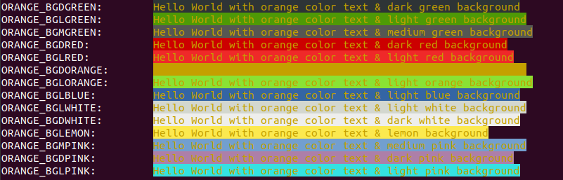

## BLACK

 USED VARIABLE | COLOR CODE FOR C/C++ | COLOR CODE FOR JAVA | OUTPUT
---------------|----------------------|---------------------|--------
 BLACK_BGDGREEN | \x1B[30;40m | \u001B[30;40m | [normal text](#output-black)
 BLACK_BGLGREEN | \x1B[30;42m | \u001B[30;42m | [normal text](#output-black)
 BLACK_BGMGREEN | \x1B[30;100m | \u001B[30;100m | [normal text](#output-black)
 BLACK_BGDRED | \x1B[30;41m | \u001B[30;41m | [normal text](#output-black)
 BLACK_BGLRED | \x1B[30;101m | \u001B[30;101m | [normal text](#output-black)
 BLACK_BGDORANGE | \x1B[30;43m | \u001B[30;43m | [normal text](#output-black)
 BLACK_BGLORANGE | \x1B[30;102m | \u001B[30;102m | [normal text](#output-black)
 BLACK_BGLBLUE | \x1B[30;44m | \u001B[30;44m | [normal text](#output-black)
 BLACK_BGLWHITE | \x1B[30;47m | \u001B[30;47m | [normal text](#output-black)
 BLACK_BGDWHITE | \x1B[30;107m | \u001B[30;107m | [normal text](#output-black)
 BLACK_BGLEMON | \x1B[30;103m | \u001B[30;103m | [normal text](#output-black)
 BLACK_BGMPINK | \x1B[30;104m | \u001B[30;104m | [normal text](#output-black)
 BLACK_BGDPINK | \x1B[30;105m | \u001B[30;105m | [normal text](#output-black)
 BLACK_BGLPINK | \x1B[30;106m | \u001B[30;106m | [normal text](#output-black)

### OUTPUT BLACK

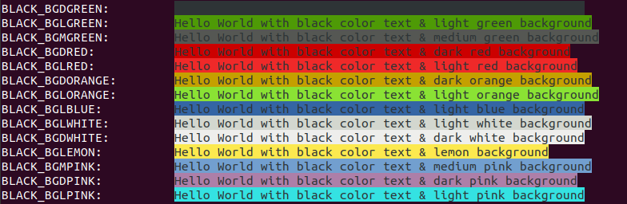

## MAGENTA

 USED VARIABLE | COLOR CODE FOR C/C++ | COLOR CODE FOR JAVA | OUTPUT
---------------|----------------------|---------------------|--------
 MAGENTA_BGDGREEN | \x1B[35;40m | \u001B[35;40m | [normal text](#output-magenta)
 MAGENTA_BGLGREEN | \x1B[35;42m | \u001B[35;42m | [normal text](#output-magenta)
 MAGENTA_BGMGREEN | \x1B[35;100m | \u001B[35;100m | [normal text](#output-magenta)
 MAGENTA_BGDRED | \x1B[35;41m | \u001B[35;41m | [normal text](#output-magenta)
 MAGENTA_BGLRED | \x1B[35;101m | \u001B[35;101m | [normal text](#output-magenta)
 MAGENTA_BGDORANGE | \x1B[35;43m | \u001B[35;43m | [normal text](#output-magenta)
 MAGENTA_BGLORANGE | \x1B[35;102m | \u001B[35;102m | [normal text](#output-magenta)
 MAGENTA_BGLBLUE | \x1B[35;44m | \u001B[35;44m | [normal text](#output-magenta)
 MAGENTA_BGLWHITE | \x1B[35;47m | \u001B[35;47m | [normal text](#output-magenta)
 MAGENTA_BGDWHITE | \x1B[35;107m | \u001B[35;107m | [normal text](#output-magenta)
 MAGENTA_BGLEMON | \x1B[35;103m | \u001B[35;103m | [normal text](#output-magenta)
 MAGENTA_BGMPINK | \x1B[35;104m | \u001B[35;104m | [normal text](#output-magenta)
 MAGENTA_BGDPINK | \x1B[35;105m | \u001B[35;105m | [normal text](#output-magenta)
 MAGENTA_BGLPINK | \x1B[35;106m | \u001B[35;106m | [normal text](#output-magenta)

### OUTPUT MAGENTA

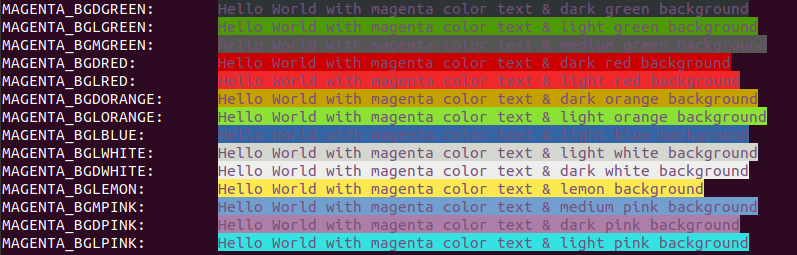

## YELLOW

 USED VARIABLE | COLOR CODE FOR C/C++ | COLOR CODE FOR JAVA | OUTPUT
---------------|----------------------|---------------------|--------
 YELLOW_BGDGREEN | \x1B[92;40m | \u001B[92;40m | [normal text](#output-yellow)
 YELLOW_BGLGREEN | \x1B[92;42m | \u001B[92;42m | [normal text](#output-yellow)
 YELLOW_BGMGREEN | \x1B[92;100m | \u001B[92;100m | [normal text](#output-yellow)
 YELLOW_BGDRED | \x1B[92;41m | \u001B[92;41m | [normal text](#output-yellow)
 YELLOW_BGLRED | \x1B[92;101m | \u001B[92;101m | [normal text](#output-yellow)
 YELLOW_BGDORANGE | \x1B[92;43m | \u001B[92;43m | [normal text](#output-yellow)
 YELLOW_BGLORANGE | \x1B[92;102m | \u001B[92;102m | [normal text](#output-yellow)
 YELLOW_BGLBLUE | \x1B[92;44m | \u001B[92;44m | [normal text](#output-yellow)
 YELLOW_BGLWHITE | \x1B[92;47m | \u001B[92;47m | [normal text](#output-yellow)
 YELLOW_BGDWHITE | \x1B[92;107m | \u001B[92;107m | [normal text](#output-yellow)
 YELLOW_BGLEMON | \x1B[92;103m | \u001B[92;103m | [normal text](#output-yellow)
 YELLOW_BGMPINK | \x1B[92;104m | \u001B[92;104m | [normal text](#output-yellow)
 YELLOW_BGDPINK | \x1B[92;105m | \u001B[92;105m | [normal text](#output-yellow)
 YELLOW_BGLPINK | \x1B[92;106m | \u001B[92;106m | [normal text](#output-yellow)

### OUTPUT YELLOW

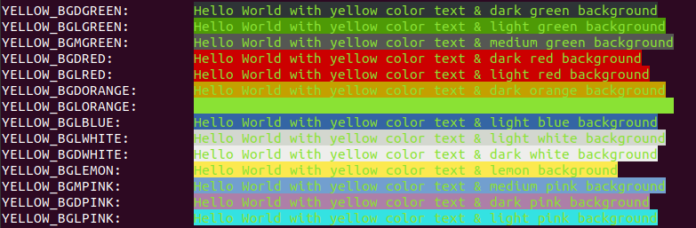

## LEMON

 USED VARIABLE | COLOR CODE FOR C/C++ | COLOR CODE FOR JAVA | OUTPUT
---------------|----------------------|---------------------|--------
 LEMON_BGDGREEN | \x1B[93;40m | \u001B[93;40m | [normal text](#output-lemon)
 LEMON_BGLGREEN | \x1B[93;42m | \u001B[93;42m | [normal text](#output-lemon)
 LEMON_BGMGREEN | \x1B[93;100m | \u001B[93;100m | [normal text](#output-lemon)
 LEMON_BGDRED | \x1B[93;41m | \u001B[93;41m | [normal text](#output-lemon)
 LEMON_BGLRED | \x1B[93;101m | \u001B[93;101m | [normal text](#output-lemon)
 LEMON_BGDORANGE | \x1B[93;43m | \u001B[93;43m | [normal text](#output-lemon)
 LEMON_BGLORANGE | \x1B[93;102m | \u001B[93;102m | [normal text](#output-lemon)
 LEMON_BGLBLUE | \x1B[93;44m | \u001B[93;44m | [normal text](#output-lemon)
 LEMON_BGLWHITE | \x1B[93;47m | \u001B[93;47m | [normal text](#output-lemon)
 LEMON_BGDWHITE | \x1B[93;107m | \u001B[93;107m | [normal text](#output-lemon)
 LEMON_BGLEMON | \x1B[93;103m | \u001B[93;103m | [normal text](#output-lemon)
 LEMON_BGMPINK | \x1B[93;104m | \u001B[93;104m | [normal text](#output-lemon)
 LEMON_BGDPINK | \x1B[93;105m | \u001B[93;105m | [normal text](#output-lemon)
 LEMON_BGLPINK | \x1B[93;106m | \u001B[93;106m | [normal text](#output-lemon)

### OUTPUT LEMON

## PINK

 USED VARIABLE | COLOR CODE FOR C/C++ | COLOR CODE FOR JAVA | OUTPUT
---------------|----------------------|---------------------|--------
 PINK_BGDGREEN | \x1B[95;40m | \u001B[95;40m | [normal text](#output-pink)
 PINK_BGLGREEN | \x1B[95;42m | \u001B[95;42m | [normal text](#output-pink)
 PINK_BGMGREEN | \x1B[95;100m | \u001B[95;100m | [normal text](#output-pink)
 PINK_BGDRED | \x1B[95;41m | \u001B[95;41m | [normal text](#output-pink)
 PINK_BGLRED | \x1B[95;101m | \u001B[95;101m | [normal text](#output-pink)
 PINK_BGDORANGE | \x1B[95;43m | \u001B[95;43m | [normal text](#output-pink)
 PINK_BGLORANGE | \x1B[95;102m | \u001B[95;102m | [normal text](#output-pink)
 PINK_BGLBLUE | \x1B[95;44m | \u001B[95;44m | [normal text](#output-pink)
 PINK_BGLWHITE | \x1B[95;47m | \u001B[95;47m | [normal text](#output-pink)
 PINK_BGDWHITE | \x1B[95;107m | \u001B[95;107m | [normal text](#output-pink)
 PINK_BGLEMON | \x1B[95;103m | \u001B[95;103m | [normal text](#output-pink)
 PINK_BGMPINK | \x1B[95;104m | \u001B[95;104m | [normal text](#output-pink)
 PINK_BGDPINK | \x1B[95;105m | \u001B[95;105m | [normal text](#output-pink)
 PINK_BGLPINK | \x1B[95;106m | \u001B[95;106m | [normal text](#output-pink)

### OUTPUT PINK

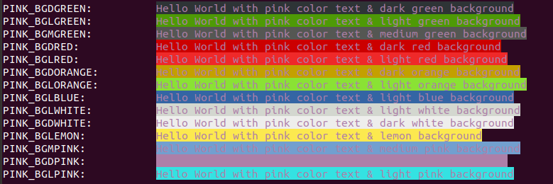
