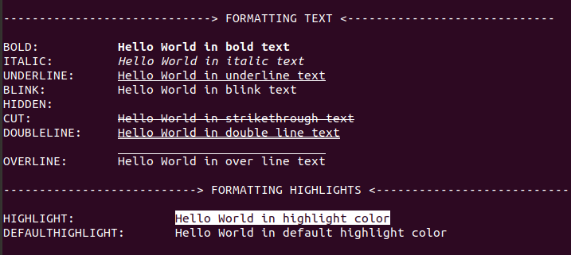

# FORMATTING TEXT

 USED VARIABLE | COLOR CODE  FOR C/C++ | COLOR CODE FOR JAVA | OUTPUT
---------------|-----------------------|---------------------|--------
 RESET | \x1B[0m | \u001B[0m | [RESET NORMAL](#output)
 BOLD | \x1B[1m | \u001B[1m | [BOLD WHITE](#output)
 ITALIC | \x1B[3m | \u001B[3m | [ITALIC TEXT](#output)
 UNDERLINE | \x1B[4m | \u001B[4m | [UNDERLINE TEXT](#output)
 BLINK | \x1B[5m | \u001B[5m | [BLINKING TEXT](#output)
 HIDDEN | \x1B[8m | \u001B[8m | [HIDDEN TEXT](#output)
 CUT | \x1B[9m | \u001B[9m | [CUT TEXT](#output)
 DOUBLELINE | \x1B[21m | \u001B[21m | [DOUBLE LINED TEXT](#output)
 OVERLINE | \x1B[53m | \u001B[53m | [OVERLINED TEXT](#output)
 HIGHLIGHT | \x1B[7m | \u001B[7m | [HIGHLIGHTED TEXT](#output)
 DEFAULTHIGHLIGHT | \x1B[98m | \u001B[98m | [DEFAULT HIGHLIGHT TEXT](#output)

## OUTPUT

