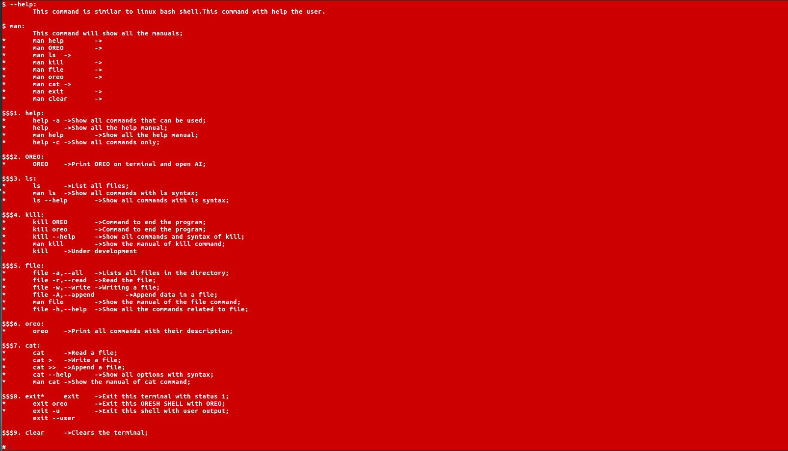
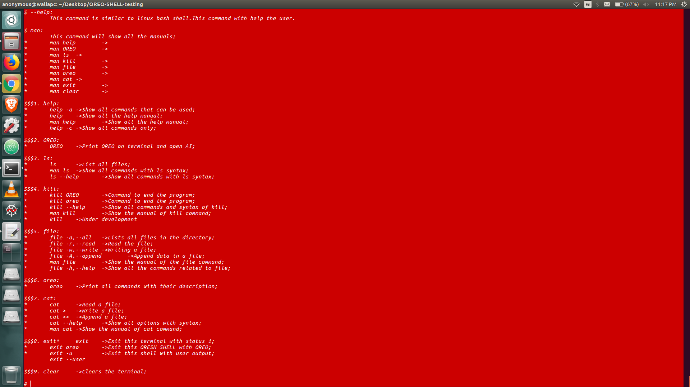
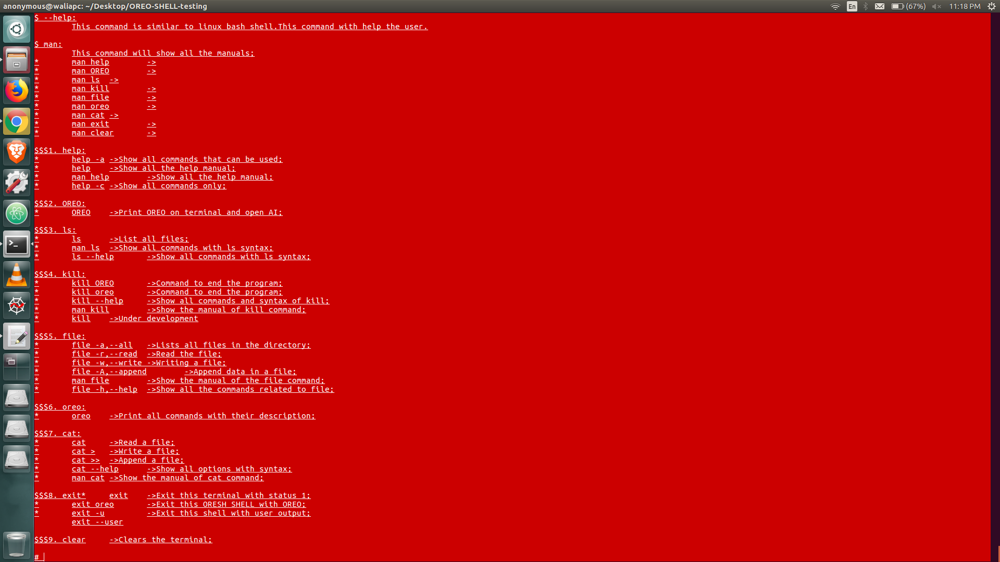

# [:arrow_left:](COLORS.md) FORMATTING WITH BACKGROUND [:arrow_right:](formattingcolors.md)

 USED VARIABLE | COLOR CODE FOR C/C++ | COLOR CODE FOR JAVA | OUTPUT
---------------|----------------------|---------------------|--------
 BBGGREEN | \x1B[1;40m | \u001B[1;40m | BOLD TEXT-GREENISH BG
 IBGGREEN | \x1B[3;40m | \u001B[3;40m | ITALIC TEXT-GREENISH BG
 UBGGREEN | \x1B[4;40m | \u001B[4;40m | UNDERLINE TEXT-GREENISH BG
 BBGRED | \x1B[1;41m | \u001B[1;41m | BOLD TEXT-RED BG
 IBGRED | \x1B[3;41m | \u001B[3;41m | ITALIC TEXT-RED BG
 UBGRED | \x1B[4;41m | \u001B[4;41m | UNDERLINE TEXT-RED BG
 BBGLGREEN | \x1B[1;42m | \u001B[1;42m | BOLD TEXT-LIGHT GREEN BG
 IBGLGREEN | \x1B[3;42m | \u001B[3;42m | ITALIC TEXT-LIGHT GREEN BG
 UBGLGREEN | \x1B[4;42m | \u001B[4;42m | UNDERLINE TEXT-LIGHT GREEN BG
 BBGORANGE | \x1B[1;43m | \u001B[1;43m | BOLD TEXT-ORANGE BG
 IBGORANGE | \x1B[3;43m | \u001B[3;43m | ITALIC TEXT-ORANGE BG
 UBGORANGE | \x1B[4;43m | \u001B[4;43m | UNDERLINE TEXT-ORANGE BG
 BBGLBLUE | \x1B[1;44m | \u001B[1;44m | BOLD TEXT-LIGHT BLUE BG
 IBGLBLUE | \x1B[3;44m | \u001B[3;44m | ITALIC TEXT-LIGHT BLUE BG
 UBGLBLUE | \x1B[4;44m | \u001B[4;44m | UNDERLINE TEXT-LIGHT BLUE BG
 BBGPINK | \x1B[1;45m | \u001B[1;45m | BOLD TEXT-PINK BG
 IBGPINK | \x1B[3;45m | \u001B[3;45m | ITALIC TEXT-PINK BG
 UBGPINK | \x1B[4;45m | \u001B[4;45m | UNDERLINE TEXT-PINK BG
 BBGDGREEN | \x1B[1;46m | \u001B[1;46m | BOLD TEXT-DARK GREEN BG
 IBGDGREEN | \x1B[3;46m | \u001B[3;46m | ITALIC TEXT-DARK GREEN BG
 UBGDGREEN | \x1B[4;46m | \u001B[4;46m | UNDERLINE TEXT-DARK GREEN BG
 BBGWHITE | \x1B[1;47m | \u001B[1;47m | BOLD TEXT WHITE-GREEN BG
 IBGWHITE | \x1B[3;47m | \u001B[3;47m | ITALIC TEXT WHITE-GREEN BG
 UBGWHITE | \x1B[4;47m | \u001B[4;47m | UNDERLINEWHITE-GREEN BG

## OUTPUT

### :rocket: BBGGREEN

### :rocket: IBGGREEN

### :rocket: UBGGREEN

### :rocket: BBGRED

### :rocket: IBGRED

### :rocket: UBGRED

