# [:arrow_left:](COLORS.md) FORMATTING WITH BACKGROUND

## DGREEN

 USED VARIABLE | COLOR CODE FOR C/C++ | COLOR CODE FOR JAVA | OUTPUT
---------------|----------------------|---------------------|--------
 BBGDGREEN | \x1B[1;40m | \u001B[1;40m | [BOLD TEXT](#dgreen-output)
 IBGDGREEN | \x1B[3;40m | \u001B[3;40m | [ITALIC TEXT](#dgreen-output)
 ULBGDGREEN | \x1B[4;40m | \u001B[4;40m | [UNDERLINE TEXT](#dgreen-output)
 BKBGDGREEN | \x1B[5;40m | \u001B[5;40m | [BLINKING TEXT](#dgreen-output)
 CBGDGREEN | \x1B[9;40m | \u001B[9;40m | [STRIKETHROUGH TEXT](#dgreen-output)
 DLBGDGREEN | \x1B[21;40m | \u001B[21;40m | [DOUBLE LINE TEXT](#dgreen-output)
 OLBGDGREEN | \x1B[53;40m | \u001B[53;40m | [OVER LINE TEXT](#dgreen-output)

### DGREEN OUTPUT

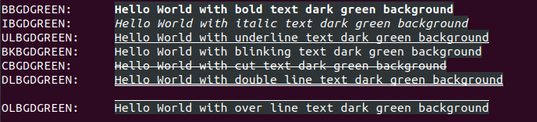

## LGREEN

 USED VARIABLE | COLOR CODE FOR C/C++ | COLOR CODE FOR JAVA | OUTPUT
---------------|----------------------|---------------------|--------
 BBGLGREEN | \x1B[1;42m | \u001B[1;42m | [BOLD TEXT](#lgreen-output)
 IBGLGREEN | \x1B[3;42m | \u001B[3;42m | [ITALIC TEXT](#lgreen-output)
 ULBGLGREEN | \x1B[4;42m | \u001B[4;42m | [UNDERLINE TEXT](#lgreen-output)
 BKBGLGREEN | \x1B[5;42m | \u001B[5;42m | [BLINKING TEXT](#lgreen-output)
 CBGLGREEN | \x1B[9;42m | \u001B[9;42m | [STRIKETHROUGH TEXT](#lgreen-output)
 DLBGLGREEN | \x1B[21;42m | \u001B[21;42m | [DOUBLE LINE TEXT](#lgreen-output)
 OLBGLGREEN | \x1B[53;42m | \u001B[53;42m | [OVER LINE TEXT](#lgreen-output)

### LGREEN OUTPUT

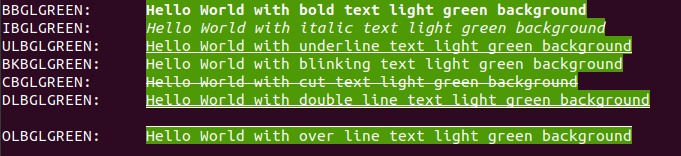

## MGREEN

 USED VARIABLE | COLOR CODE FOR C/C++ | COLOR CODE FOR JAVA | OUTPUT
---------------|----------------------|---------------------|--------
 BBGMGREEN | \x1B[1;100m | \u001B[1;100m | [BOLD TEXT](#mgreen-output)
 IBGMGREEN | \x1B[3;100m | \u001B[3;100m | [ITALIC TEXT](#mgreen-output)
 ULBGMGREEN | \x1B[4;100m | \u001B[4;100m | [UNDERLINE TEXT](#mgreen-output)
 BKBGMGREEN | \x1B[5;100m | \u001B[5;100m | [BLINKING TEXT](#mgreen-output)
 CBGMGREEN | \x1B[9;100m | \u001B[9;100m | [STRIKETHROUGH TEXT](#mgreen-output)
 DLBGMGREEN | \x1B[21;100m | \u001B[21;100m | [DOUBLE LINE TEXT](#mgreen-output)
 OLBGMGREEN | \x1B[53;100m | \u001B[53;100m | [OVER LINE TEXT](#mgreen-output)

### MGREEN OUTPUT

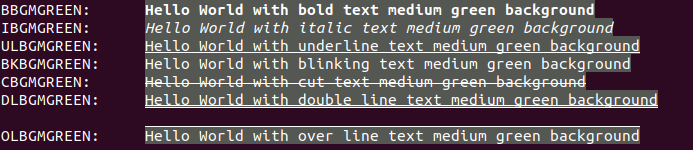

## DRED

 USED VARIABLE | COLOR CODE FOR C/C++ | COLOR CODE FOR JAVA | OUTPUT
---------------|----------------------|---------------------|--------
 BBGDRED | \x1B[1;41m | \u001B[1;41m | [BOLD TEXT](#dred-output)
 IBGDRED | \x1B[3;41m | \u001B[3;41m | [ITALIC TEXT](#dred-output)
 ULBGDRED | \x1B[4;41m | \u001B[4;41m | [UNDERLINE TEXT](#dred-output)
 BKBGDRED | \x1B[5;41m | \u001B[5;41m | [BLINK TEXT](#dred-output)
 CBGDRED | \x1B[9;41m | \u001B[9;41m | [STRIKETHROUGH TEXT](#dred-output)
 DLBGDRED | \x1B[21;41m | \u001B[21;41m | [DOUBLE LINE TEXT](#dred-output)
 OLBGDRED | \x1B[53;41m | \u001B[53;41m | [OVER LINE TEXT](#dred-output)

### DRED OUTPUT

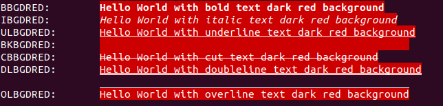

## LRED

 USED VARIABLE | COLOR CODE FOR C/C++ | COLOR CODE FOR JAVA | OUTPUT
---------------|----------------------|---------------------|--------
 BBGLRED | \x1B[1;101m | \u001B[1;101m | [BOLD TEXT](#lred-output)
 IBGLRED | \x1B[3;101m | \u001B[3;101m | [ITALIC TEXT](#lred-output)
 ULBGLRED | \x1B[4;101m | \u001B[4;101m | [UNDERLINE TEXT](#lred-output)
 BKBGLRED | \x1B[5;101m | \u001B[5;101m | [BLINKING TEXT](#lred-output)
 CGLRED | \x1B[9;101m | \u001B[9;101m | [STRIKETHROUGH TEXT](#lred-output)
 DLBGLRED | \x1B[21;101m | \u001B[21;101m | [DOUBLE LINE TEXT](#lred-output)
 OLBGLRED | \x1B[53;101m | \u001B[53;101m | [OVER LINE TEXT](#lred-output)

### LRED OUTPUT

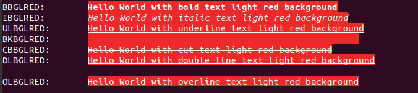

## DORANGE

 USED VARIABLE | COLOR CODE FOR C/C++ | COLOR CODE FOR JAVA | OUTPUT
---------------|----------------------|---------------------|--------
 BBGDORANGE  | \x1B[1;43m | \u001B[1;43m | [BOLD TEXT](#dorange-output)
 IBGDORANGE  | \x1B[3;43m | \u001B[3;43m | [ITALIC TEXT](#dorange-output)
 ULBGDORANGE  | \x1B[4;43m | \u001B[4;43m | [UNDERLINE TEXT](#dorange-output)
 BKBGDORANGE  | \x1B[5;43m | \u001B[5;43m | [BLINKING TEXT](#dorange-output)
 CBGDORANGE  | \x1B[9;43m | \u001B[9;43m | [STRIKETHROUGH TEXT](#dorange-output)
 DLBGDORANGE  | \x1B[21;43m | \u001B[21;43m | [DOUBLE LINE TEXT](#dorange-output)
 OLBGDORANGE  | \x1B[53;43m | \u001B[53;43m | [OVER LINE TEXT](#dorange-output)

### DORANGE OUTPUT

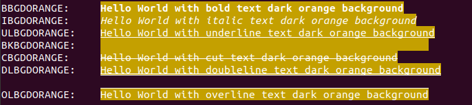

## LORANGE

 USED VARIABLE | COLOR CODE FOR C/C++ | COLOR CODE FOR JAVA | OUTPUT
---------------|----------------------|---------------------|--------
 BBGLORANGE | \x1B[1;102m | \u001B[1;102m | [BOLD TEXT](#lorange-output)
 IBGLORANGE | \x1B[3;102m | \u001B[3;102m | [ITALIC TEXT](#lorange-output)
 ULBGLORANGE | \x1B[4;102m | \u001B[4;102m | [UNDERLINE TEXT](#lorange-output)
 BKBGLORANGE | \x1B[5;102m | \u001B[5;102m | [BLINKING TEXT](#lorange-output)
 CBGLORANGE | \x1B[9;102m | \u001B[9;102m | [STRIKETHROUGH TEXT](#lorange-output)
 DLBGLORANGE | \x1B[21;102m | \u001B[21;102m | [DOUBLE LINE TEXT](#lorange-output)
 OLBGLORANGE | \x1B[53;102m | \u001B[53;102m | [OVER LINE TEXT](#lorange-output)

### LORANGE OUTPUT

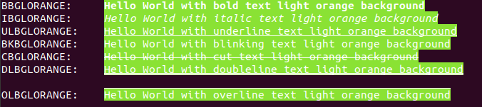

## LBLUE

 USED VARIABLE | COLOR CODE FOR C/C++ | COLOR CODE FOR JAVA | OUTPUT
---------------|----------------------|---------------------|--------
 BBGLBLUE | \x1B[1;44m | \001B[1;44m | [BOLD TEXT](#lblue-output)
 IBGLBLUE | \x1B[3;44m | \001B[3;44m | [ITALIC TEXT](#lblue-output)
 ULBGLBLUE | \x1B[4;44m | \001B[4;44m | [UNDERLINE TEXT](#lblue-output)
 BKBGLBLUE | \x1B[5;44m | \001B[5;44m | [BLINKING TEXT](#lblue-output)
 CBGLBLUE | \x1B[9;44m | \001B[9;44m | [STRIKETHROUGH TEXT](#lblue-output)
 DLBGLBLUE | \x1B[21;44m | \001B[21;44m | [DOUBLE LINE TEXT](#lblue-output)
 OLBGLBLUE | \x1B[53;44m | \001B[53;44m | [OVER LINE TEXT](#lblue-output)

### LBLUE OUTPUT

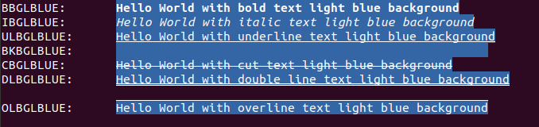

## LWHITE

 USED VARIABLE | COLOR CODE FOR C/C++ | COLOR CODE FOR JAVA | OUTPUT
---------------|----------------------|---------------------|--------
 BBGLWHITE | \x1B[1;47m | \u001B[1;47m | [BOLD TEXT](#lwhite-output)
 IBGLWHITE | \x1B[3;47m | \u001B[3;47m | [ITALIC TEXT](#lwhite-output)
 ULBGLWHITE | \x1B[4;47m | \u001B[4;47m | [UNDERLINE TEXT](#lwhite-output)
 BKBGLWHITE | \x1B[5;47m | \u001B[5;47m | [BLINKING TEXT](#lwhite-output)
 CBGLWHITE | \x1B[9;47m | \u001B[9;47m | [STRIKETHROUGH TEXT](#lwhite-output)
 DLBGLWHITE | \x1B[21;47m | \u001B[21;47m | [DOUBLE LINE TEXT](#lwhite-output)
 OLBGLWHITE | \x1B[53;47m | \u001B[53;47m | [OVER LINE TEXT](#lwhite-output)

### LWHITE OUTPUT

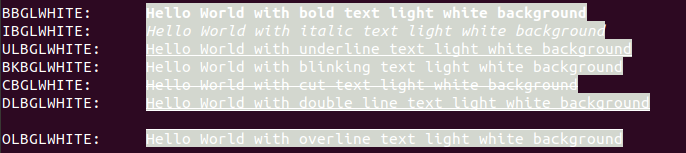

## DWHITE

 USED VARIABLE | COLOR CODE FOR C/C++ | COLOR CODE FOR JAVA | OUTPUT
---------------|----------------------|---------------------|--------
 BBGDWHITE | \x1B[1;107m | \u001B[1;107m | [BOLD TEXT](dwhite-output)
 IBGDWHITE | \x1B[3;107m | \u001B[3;107m | [ITALIC TEXT](dwhite-output)
 ULBGDWHITE | \x1B[4;107m | \u001B[4;107m | [UNDERLINE TEXT](dwhite-output)
 BKBGDWHITE | \x1B[5;107m | \u001B[5;107m | [BLINKING TEXT](dwhite-output)
 CBGDWHITE | \x1B[9;107m | \u001B[9;107m | [STRIKETHROUGH TEXT](dwhite-output)
 DLBGDWHITE | \x1B[21;107m | \u001B[21;107m | [DOUBLE LINE TEXT](dwhite-output)
 OLBGDWHITE | \x1B[53;107m | \u001B[53;107m | [OVER LINE TEXT](dwhite-output)

### DWHITE OUTPUT

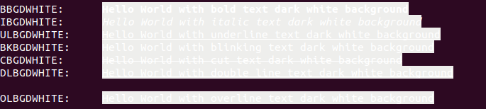

## LEMON

 USED VARIABLE | COLOR CODE FOR C/C++ | COLOR CODE FOR JAVA | OUTPUT
---------------|----------------------|---------------------|--------
 BBGLEMON | \x1B[1;103m | \u001B[1;103m | [BOLD TEXT](#lemon-output)
 IBGLEMON | \x1B[3;103m | \u001B[3;103m | [ITALIC TEXT](#lemon-output)
 ULBGLEMON | \x1B[4;103m | \u001B[4;103m | [UNDERLINE TEXT](#lemon-output)
 BKBGLEMON | \x1B[5;103m | \u001B[5;103m | [BLINKING TEXT](#lemon-output)
 CBGLEMON | \x1B[9;103m | \u001B[9;103m | [STRIKETHROUGH TEXT](#lemon-output)
 DLBGLEMON | \x1B[21;103m | \u001B[21;103m | [DOUBLE LINE TEXT](#lemon-output)
 OLBGLEMON | \x1B[53;103m | \u001B[53;103m | [OVER LINE TEXT](#lemon-output)

### LEMON OUTPUT

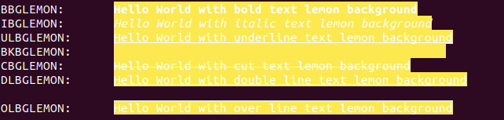

## DPINK

 USED VARIABLE | COLOR CODE FOR C/C++ | COLOR CODE FOR JAVA | OUTPUT
---------------|----------------------|---------------------|--------
 BBGDPINK | \x1B[1;105m | \u001B[1;105m | [BOLD TEXT](#dpink-output)
 IBGDPINK | \x1B[3;105m | \u001B[3;105m | [ITALIC TEXT](#dpink-output)
 ULBGDPINK | \x1B[4;105m | \u001B[4;105m | [UNDERLINE TEXT](#dpink-output)
 BKBGDPINK | \x1B[5;105m | \u001B[5;105m | [BLINKING TEXT](#dpink-output)
 CBGDPINK | \x1B[9;105m | \u001B[9;105m | [STRIKETHROUGH TEXT](#dpink-output)
 DLBGDPINK | \x1B[21;105m | \u001B[21;105m | [DOUBLE LINE TEXT](#dpink-output)
 OLBGDPINK | \x1B[53;105m | \u001B[53;105m | [OVER LINE TEXT](#dpink-output)

### DPINK OUTPUT

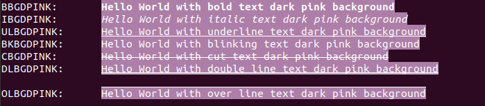

## LPINK

 USED VARIABLE | COLOR CODE FOR C/C++ | COLOR CODE FOR JAVA | OUTPUT
---------------|----------------------|---------------------|--------
 BBGLPINK | \x1B[1;106m | \001B[1;106m | [BOLD TEXT](lpink-output)
 IBGLPINK | \x1B[3;106m | \001B[3;106m | [ITALIC TEXT](lpink-output)
 ULBGLPINK | \x1B[4;106m | \001B[4;106m | [UNDERLINE TEXT](lpink-output)
 BKBGLPINK | \x1B[5;106m | \001B[5;106m | [BLINKING TEXT](lpink-output)
 CBGLPINK | \x1B[9;106m | \001B[9;106m | [STRIKETHROUGH TEXT](lpink-output)
 DLBGLPINK | \x1B[21;106m | \001B[21;106m | [DOUBLE LINE TEXT](lpink-output)
 OLBGLPINK | \x1B[53;106m | \001B[53;106m | [OVER LINE TEXT](lpink-output)

### LPINK OUTPUT

## MPINK

 USED VARIABLE | COLOR CODE FOR C/C++ | COLOR CODE FOR JAVA | OUTPUT
---------------|----------------------|---------------------|--------
 BBGMPINK | \x1B[1;104m | \u001B[1;104m | [BOLD TEXT](#mpink-output)
 IBGMPINK | \x1B[3;104m | \u001B[3;104m | [ITALIC TEXT](#mpink-output)
 ULBGMPINK | \x1B[4;104m | \u001B[4;104m | [UNDERLINE TEXT](#mpink-output)
 BKBGMPINK | \x1B[5;104m | \u001B[5;104m | [BLINKING TEXT](#mpink-output)
 CBGMPINK | \x1B[9;104m | \u001B[9;104m | [STRIKETHROUGH TEXT](#mpink-output)
 DLBGMPINK | \x1B[21;104m | \u001B[21;104m | [DOUBLE LINE TEXT](#mpink-output)
 OLBGMPINK | \x1B[53;104m | \u001B[53;104m | [OVER LINE TEXT](#mpink-output)

### MPINK OUTPUT

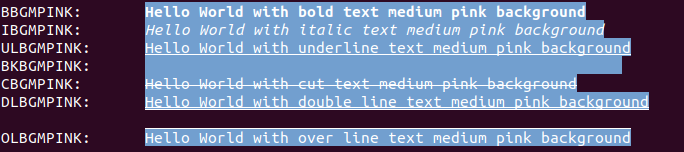
