# [:arrow_left:](formattingbg.md) FORMATTING WITH COLORS

## LIGHT GREEN

 USED VARIABLE | COLOR CODE FOR C/C++ | COLOR CODE FOR JAVA | LIGHT GREEN COLOR
---------------|----------------------|---------------------|-------------------
 BLGREEN | \x1B[1;32m | \u001B[1;32m | [BOLD TEXT](#light-green-output)
 ILGREEN | \x1B[3;32m | \u001B[3;32m | [ITALIC TEXT](#light-green-output)
 ULLGREEN | \x1B[4;32m | \u001B[4;32m | [UNDERLINE TEXT](#light-green-output)
 BKLGREEN | \x1B[5;32m | \u001B[5;32m | [BLINK TEXT](#light-green-output)
 CLGREEN | \x1B[9;32m | \u001B[9;32m | [STRIKETHROUGH TEXT](#light-green-output)
 DLLGREEN | \x1B[21;32m | \u001B[21;32m | [DOUBLELINE TEXT](#light-green-output)
 OLLGREEN | \x1B[53;32m | \u001B[53;32m | [OVERLINE TEXT](#light-green-output)

### LIGHT GREEN OUTPUT

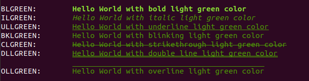

## DARK GREEN

 USED VARIABLE | COLOR CODE FOR C/C++ | COLOR CODE FOR JAVA | DARK GREEN COLOR
---------------|----------------------|---------------------|------------------
 BDGREEN | \x1B[1;90m | \u001B[1;90m | [BOLD TEXT](#dark-green-output)
 IDGREEN | \x1B[3;90m | \u001B[3;90m | [ITALIC TEXT](#dark-green-output)
 ULDGREEN | \x1B[4;90m | \u001B[4;90m | [UNDERLINE TEXT](#dark-green-output)
 BKDGREEN | \x1B[5;90m | \u001B[5;90m | [BLINK TEXT](#dark-green-output)
 CDGREEN | \x1B[9;90m | \u001B[9;90m | [CUT TEXT](#dark-green-output)
 DLDGREEN | \x1B[21;90m | \u001B[21;90m | [DOUBLE LINE TEXT](#dark-green-output)
 OLDGREEN | \x1B[53;90m | \u001B[53;90m | [OVER LINE TEXT](#dark-green-output)

### DARK GREEN OUTPUT

## MEDIUM GREEN

 USED VARIABLE | COLOR CODE FOR C/C++ | COLOR CODE FOR JAVA | MEDIUM GREEN COLOR
---------------|----------------------|---------------------|--------------------
 BMGREEN | \x1B[1;2m | \u001B[1;2m | [BOLD TEXT](#medium-green-output)
 IMGREEN | \x1B[3;2m | \u001B[3;2m | [ITALIC TEXT](#medium-green-output)
 ULMGREEN | \x1B[4;2m | \u001B[4;2m | [UNDERLINE TEXT](#medium-green-output)
 BKMGREEN | \x1B[5;2m | \u001B[5;2m | [BLINK TEXT](#medium-green-output)
 CMGREEN | \x1B[9;2m | \u001B[9;2m | [CUT TEXT](#medium-green-output)
 DLMGREEN | \x1B[21;2m | \u001B[21;2m | [DOUBLE LINE TEXT](#medium-green-output)
 OLMGREEN | \x1B[53;2m | \u001B[53;2m | [OVER LINE TEXT](#medium-green-output)

### MEDIUM GREEN OUTPUT

## LIGHT RED

 USED VARIABLE | COLOR CODE FOR C/C++ | COLOR CODE FOR JAVA | LIGHT RED COLOR
---------------|----------------------|---------------------|-----------------
 BLRED | \x1B[1;91m | \u001B[1;91m | [BOLD TEXT](#light-red-output)
 ILRED | \x1B[3;91m | \u001B[3;91m | [ITALIC TEXT](#light-red-output)
 ULLRED | \x1B[4;91m | \u001B[4;91m | [UNDER LINE TEXT](#light-red-output)
 BKLRED | \x1B[5;91m | \u001B[5;91m | [BLINK TEXT](#light-red-output)
 CLRED | \x1B[9;91m | \u001B[9;91m | [CUT TEXT](#light-red-output)
 DLLRED | \x1B[21;91m | \u001B[21;91m | [DOUBLE LINE TEXT](#light-red-output)
 OLLRED | \x1B[53;91m | \u001B[53;91m | [OVER LINE TEXT](#light-red-output)

### LIGHT RED OUTPUT

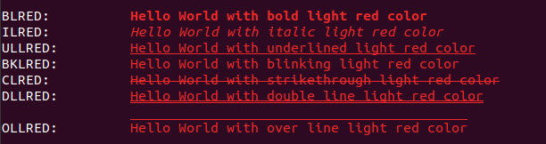

## DARK RED

 USED VARIABLE | COLOR CODE FOR C/C++ | COLOR CODE FOR JAVA | DARK RED COLOR
---------------|----------------------|---------------------|----------------
 BDRED | \x1B[1;31m | \u001B[1;31m | [BOLD TEXT](#dark-red-output)
 IDRED | \x1B[3;31m | \u001B[3;31m | [ITALIC TEXT](#dark-red-output)
 ULDRED | \x1B[4;31m | \u001B[4;31m | [UNDER LINE TEXT](#dark-red-output)
 BKDRED | \x1B[5;31m | \u001B[5;31m | [BLINK TEXT](#dark-red-output)
 CDRED | \x1B[9;31m | \u001B[9;31m | [CUT TEXT](#dark-red-output)
 DLDRED | \x1B[21;31m | \u001B[21;31m | [DOUBLE LINE TEXT](#dark-red-output)
 OLDRED | \x1B[53;31m | \u001B[53;31m | [OVER LINE TEXT](#dark-red-output)

### DARK RED OUTPUT

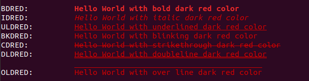

## LIGHT WHITE

 USED VARIABLE | COLOR CODE FOR C/C++ | COLOR CODE FOR JAVA | LIGHT WHITE COLOR
---------------|----------------------|---------------------|-------------------
 BLWHITE | \x1B[1;37m | \u001B[1;37m | [BOLD TEXT](#light-white-output)
 ILWHITE | \x1B[3;37m | \u001B[3;37m | [ITALIC TEXT](#light-white-output)
 ULLWHITE | \x1B[4;37m | \u001B[4;37m | [UNDER LINE TEXT](#light-white-output)
 BKLWHITE | \x1B[5;37m | \u001B[5;37m | [BLINK TEXT](#light-white-output)
 CLWHITE | \x1B[9;37m | \u001B[9;37m | [CUT TEXT](#light-white-output)
 DLLWHITE | \x1B[21;37m | \u001B[21;37m | [DOUBLE LINE TEXT](#light-white-output)
 OLLWHITE | \x1B[53;37m | \u001B[53;37m | [OVER LINE TEXT](#light-white-output)

### LIGHT WHITE OUTPUT

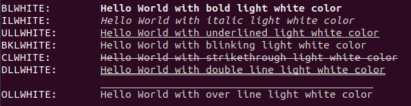

## DARK WHITE

 USED VARIABLE | COLOR CODE FOR C/C++ | COLOR CODE FOR JAVA | DARK WHITE COLOR
---------------|----------------------|---------------------|------------------
 BDWHITE | \x1B[1;97m | \u001B[1;97m | [BOLD TEXT](#dark-white-output)
 IDWHITE | \x1B[3;97m | \u001B[3;97m | [ITALIC TEXT](#dark-white-output)
 ULDWHITE | \x1B[4;97m | \u001B[4;97m | [UNDER LINE TEXT](#dark-white-output)
 BKDWHITE | \x1B[5;97m | \u001B[5;97m | [BLINK TEXT](#dark-white-output)
 CDWHITE | \x1B[9;97m | \u001B[9;97m | [CUT TEXT](#dark-white-output)
 DLDWHITE | \x1B[21;97m | \u001B[21;97m | [DOUBLE LINE TEXT](#dark-white-output)
 OLDWHITE | \x1B[53;97m | \u001B[53;97m | [OVER LINE TEXT](#dark-white-output)

### DARK WHITE OUTPUT

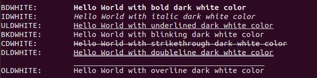

## LIGHT BLUE

 USED VARIABLE | COLOR CODE FOR C/C++ | COLOR CODE FOR JAVA | LIGHT BLUE COLOR
---------------|----------------------|---------------------|------------------
 BLBLUE | \x1B[1;94m | \u001B[1;94m | [BOLD TEXT](#light-blue-output)
 ILBLUE | \x1B[3;94m | \u001B[3;94m | [ITALIC TEXT](#light-blue-output)
 ULLBLUE | \x1B[4;94m | \u001B[4;94m | [UNDER LINE TEXT](#light-blue-output)
 BKLBLUE | \x1B[5;94m | \u001B[5;94m | [BLINK TEXT](#light-blue-output)
 CLBLUE | \x1B[9;94m | \u001B[9;94m | [CUT TEXT](#light-blue-output)
 DLLBLUE | \x1B[21;94m | \u001B[21;94m | [DOUBLE LINE TEXT](#light-blue-output)
 OLLBLUE | \x1B[53;94m | \u001B[53;94m | [OVER LINE TEXT](#light-blue-output)

### LIGHT BLUE OUTPUT

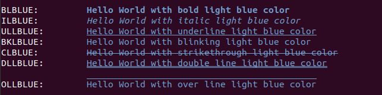

## DARK BLUE

 USED VARIABLE | COLOR CODE FOR C/C++ | COLOR CODE FOR JAVA | DARK BLUE COLOR
---------------|----------------------|---------------------|-----------------
 BDBLUE | \x1B[1;34m | \u001B[1;34m | [BOLD TEXT](#dark-blue-output)
 IDBLUE | \x1B[3;34m | \u001B[3;34m | [ITALIC TEXT](#dark-blue-output)
 ULDBLUE | \x1B[4;34m | \u001B[4;34m | [UNDER LINE TEXT](#dark-blue-output)
 BKDBLUE | \x1B[5;34m | \u001B[5;34m | [BLINK TEXT](#dark-blue-output)
 CDBLUE | \x1B[9;34m | \u001B[9;34m | [CUT TEXT](#dark-blue-output)
 DLDBLUE | \x1B[21;34m | \u001B[21;34m | [DOUBLE LINE TEXT](#dark-blue-output)
 OLDBLUE | \x1B[53;34m | \u001B[53;34m | [OVER LINE TEXT](#dark-blue-output)

### DARK BLUE OUTPUT

## LIGHT CYAN

 USED VARIABLE | COLOR CODE FOR C/C++ | COLOR CODE FOR JAVA | LIGHT CYAN COLOR
---------------|----------------------|---------------------|------------------
 BLCYAN | \x1B[1;96m | \u001B[1;96m | [BOLD TEXT](#light-cyan-output)
 ILCYAN | \x1B[3;96m | \u001B[3;96m | [ITALIC TEXT](#light-cyan-output)
 ULLCYAN | \x1B[4;96m | \u001B[4;96m | [UNDER LINE TEXT](#light-cyan-output)
 BKLCYAN | \x1B[5;96m | \u001B[5;96m | [BLINK TEXT](#light-cyan-output)
 CLCYAN | \x1B[9;96m | \u001B[9;96m | [CUT TEXT](#light-cyan-output)
 DLLCYAN | \x1B[21;96m | \u001B[21;96m | [DOUBLE LINE TEXT](#light-cyan-output)
 OLLCYAN | \x1B[53;96m | \u001B[53;96m | [OVER LINE TEXT](#light-cyan-output)

### LIGHT CYAN OUTPUT

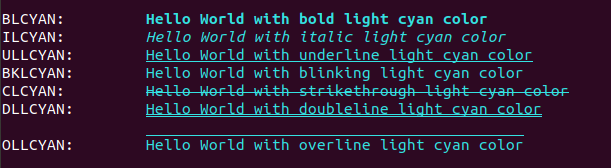

## DARK CYAN

 USED VARIABLE | COLOR CODE FOR C/C++ | COLOR CODE FOR JAVA | DARK CYAN COLOR
---------------|----------------------|---------------------|-----------------
 BDCYAN | \x1B[1;36m | \u001B[1;36m | [BOLD TEXT](#dark-cyan-output)
 IDCYAN | \x1B[3;36m | \u001B[3;36m | [ITALIC TEXT](#dark-cyan-output)
 ULDCYAN | \x1B[4;36m | \u001B[4;36m | [UNDER LINE TEXT](#dark-cyan-output)
 BKDCYAN | \x1B[5;36m | \u001B[5;36m | [BLINK TEXT](#dark-cyan-output)
 CDCYAN | \x1B[9;36m | \u001B[9;36m | [CUT TEXT](#dark-cyan-output)
 DLDCYAN | \x1B[21;36m | \u001B[21;36m | [DOUBLE LINE TEXT](#dark-cyan-output)
 OLDCYAN | \x1B[53;36m | \u001B[53;36m | [OVER LINE TEXT](#dark-cyan-output)
  
### DARK CYAN OUTPUT

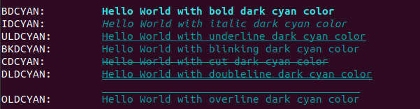

## ORANGE

 USED VARIABLE | COLOR CODE FOR C/C++ | COLOR CODE FOR JAVA | ORANGE COLOR
---------------|----------------------|---------------------|--------------
 BORANGE | \x1B[1;33m | \u001B[1;33m | [BOLD TEXT](#orange-output)
 IORANGE | \x1B[3;33m | \u001B[3;33m | [ITALIC TEXT](#orange-output)
 ULORANGE | \x1B[4;33m | \u001B[4;33m | [UNDER LINE TEXT](#orange-output)
 BKORANGE | \x1B[5;33m | \u001B[5;33m | [BLINK TEXT](#orange-output)
 CORANGE | \x1B[9;33m | \u001B[9;33m | [CUT TEXT](#orange-output)
 DLORANGE | \x1B[21;33m | \u001B[21;33m | [DOUBLE LINE TEXT](#orange-output)
 OLORANGE | \x1B[53;33m | \u001B[53;33m | [OVER LINE TEXT](#orange-output)

### ORANGE OUTPUT

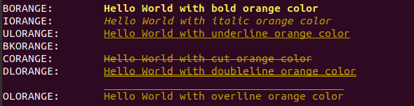

## BLACK

 USED VARIABLE | COLOR CODE FOR C/C++ | COLOR CODE FOR JAVA | BLACK COLOR
---------------|----------------------|---------------------|-------------
 BBLACK | \x1B[1;30m | \u001B[1;30m | [BOLD TEXT](#black-output)
 IBLACK | \x1B[3;30m | \u001B[3;30m | [ITALIC TEXT](#black-output)
 ULBLACK | \x1B[4;30m | \u001B[4;30m | [UNDER LINE TEXT](#black-output)
 BKBLACK | \x1B[5;30m | \u001B[5;30m | [BLINK TEXT](#black-output)
 CBLACK | \x1B[9;30m | \u001B[9;30m | [CUT TEXT](#black-output)
 DLBLACK | \x1B[21;30m | \u001B[21;30m | [DOUBLE LINE TEXT](#black-output)
 OLBLACK | \x1B[53;30m | \u001B[53;30m | [OVER LINE TEXT](#black-output)

### BLACK OUTPUT

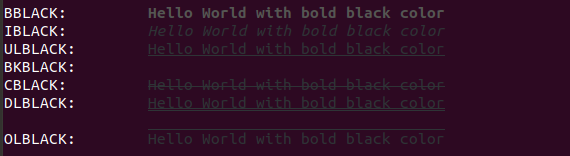

## MAGENTA

 USED VARIABLE | COLOR CODE FOR C/C++ | COLOR CODE FOR JAVA | MAGENTA COLOR
---------------|----------------------|---------------------|--------------
 BMAGENTA | \x1B[1;35m | \u001B[1;35m | [BOLD TEXT](#magenta-output)
 IMAGENTA | \x1B[3;35m | \u001B[3;35m | [ITALIC TEXT](#magenta-output)
 ULMAGENTA | \x1B[4;35m | \u001B[4;35m | [UNDER LINE TEXT](#magenta-output)
 BKMAGENTA | \x1B[5;35m | \u001B[5;35m | [BLINK TEXT](#magenta-output)
 CMAGENTA | \x1B[9;35m | \u001B[9;35m | [CUT TEXT](#magenta-output)
 DLMAGENTA | \x1B[21;35m | \u001B[21;35m | [DOUBLE LINE TEXT](#magenta-output)
 OLMAGENTA | \x1B[53;35m | \u001B[53;35m | [OVER LINE TEXT](#magenta-output)

### MAGENTA OUTPUT

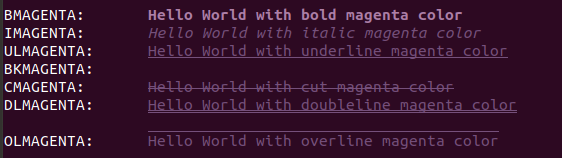

## YELLOW

 USED VARIABLE | COLOR CODE FOR C/C++ | COLOR CODE FOR JAVA | YELLOW COLOR
---------------|----------------------|---------------------|--------------
 BYELLOW | \x1B[1;92m | \u001B[1;92m | [BOLD TEXT](#yellow-output)
 IYELLOW | \x1B[3;92m | \u001B[3;92m | [ITALIC TEXT](#yellow-output)
 ULYELLOW | \x1B[4;92m | \u001B[4;92m | [UNDER LINE TEXT](#yellow-output)
 BKYELLOW | \x1B[5;92m | \u001B[5;92m | [BLINK TEXT](#yellow-output)
 CYELLOW | \x1B[9;92m | \u001B[9;92m | [CUT TEXT](#yellow-output)
 DLYELLOW | \x1B[21;92m | \u001B[21;92m | [DOUBLE LINE TEXT](#yellow-output)
 OLYELLOW | \x1B[53;92m | \u001B[53;92m | [OVER LINE TEXT](#yellow-output)

### YELLOW OUTPUT

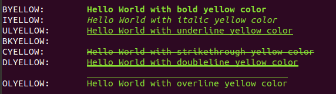

## LEMON

 USED VARIABLE | COLOR CODE FOR C/C++ | COLOR CODE FOR JAVA | LEMON COLOR
---------------|----------------------|---------------------|-------------
 BLEMON | \x1B[1;93m | \u001B[1;93m | [BOLD TEXT](#lemon-output)
 ILEMON | \x1B[3;93m | \u001B[3;93m | [ITALIC TEXT](#lemon-output)
 ULLEMON | \x1B[4;93m | \u001B[4;93m | [UNDER LINE TEXT](#lemon-output)
 BKLEMON | \x1B[5;93m | \u001B[5;93m | [BLINK TEXT](#lemon-output)
 CLEMON | \x1B[9;93m | \u001B[9;93m | [CUT TEXT](#lemon-output)
 DLLEMON | \x1B[21;93m | \u001B[21;93m | [DOUBLE LINE TEXT](#lemon-output)
 OLLEMON | \x1B[53;93m | \u001B[53;93m | [OVER LINE TEXT](#lemon-output)

### LEMON OUTPUT

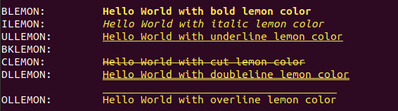

## PINK

 USED VARIABLE | COLOR CODE FOR C/C++ | COLOR CODE FOR JAVA | PINK COLOR
---------------|----------------------|---------------------|------------
 BPINK | \x1B[1;95m | \u001B[1;95m | [BOLD TEXT](#pink-output)
 IPINK | \x1B[3;95m | \u001B[3;95m | [ITALIC TEXT](#pink-output)
 ULPINK | \x1B[4;95m | \u001B[4;95m | [UNDER LINE TEXT](#pink-output)
 BKPINK | \x1B[5;95m | \u001B[5;95m | [BLINK TEXT](#pink-output)
 CPINK | \x1B[9;95m | \u001B[9;95m | [CUT TEXT](#pink-output)
 DLPINK | \x1B[21;95m | \u001B[21;95m | [DOUBLE LINE TEXT](#pink-output)
 OLPINK | \x1B[53;95m | \u001B[53;95m | [OVER LINE TEXT](#pink-output)

### PINK OUTPUT

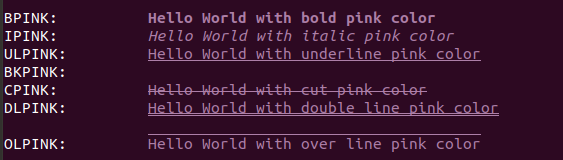
