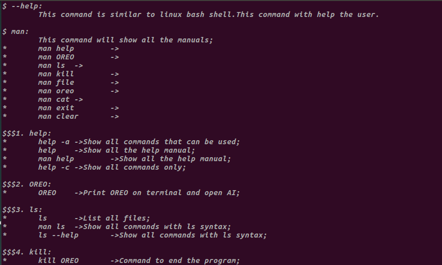
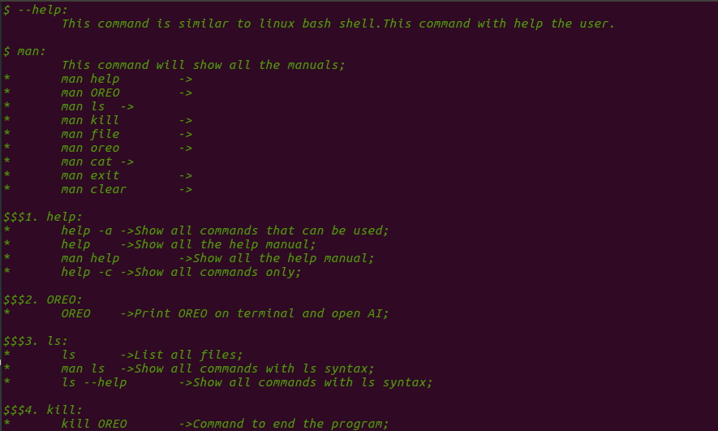
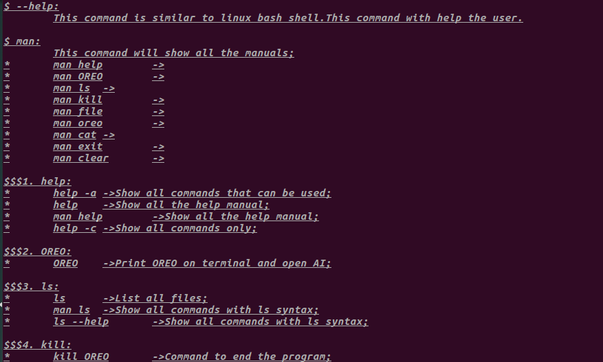
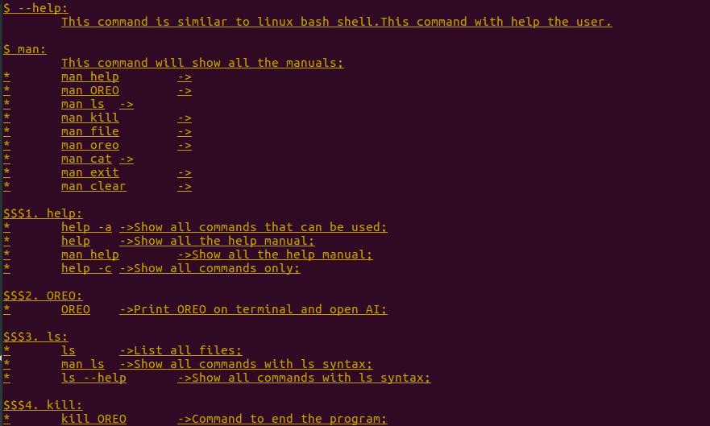
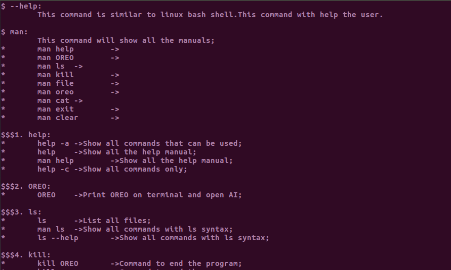
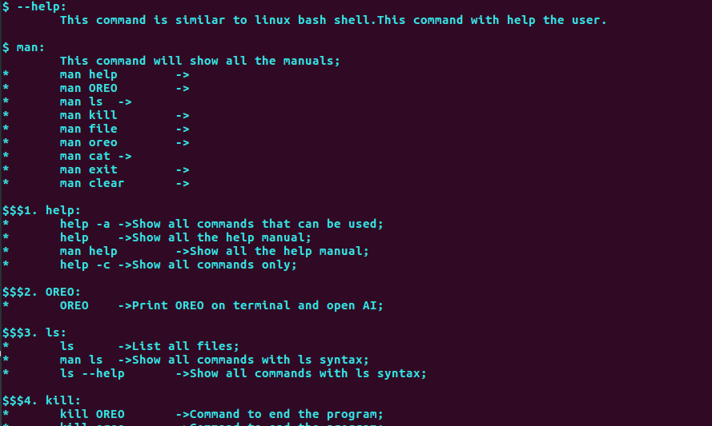
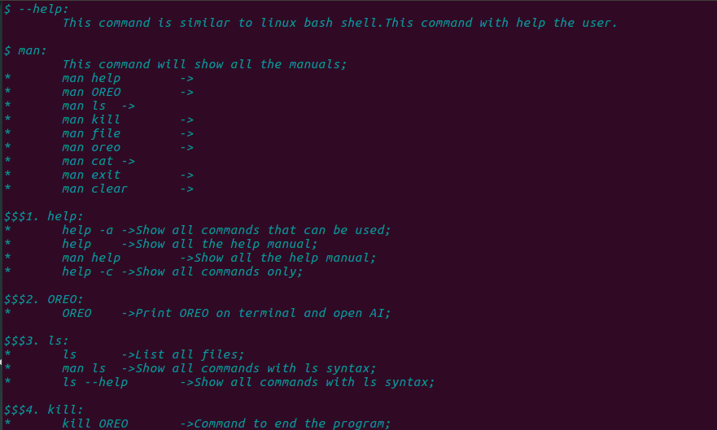
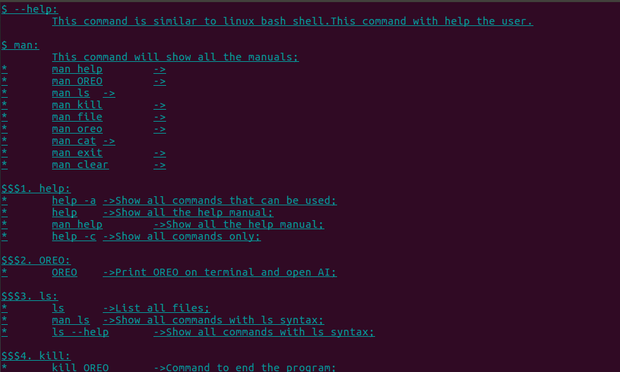
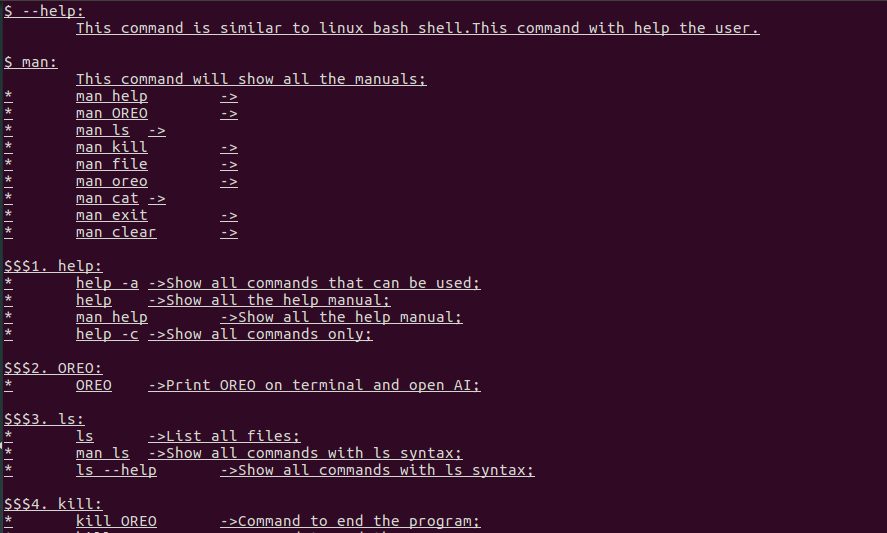

# [:arrow_left:](formattingbg.md) FORMATTING WITH COLORS

 USED VARIABLE | COLOR CODE FOR C/C++ | COLOR CODE FOR JAVA | OUTPUT COLOR
---------------|----------------------|---------------------|--------------
 BDGREEN | \x1B[1;2m | \u001B[1;2m | [BOLD DARK GREEN COLOR](#rocket-BDGREEN)
 IDGREEN | \x1B[3;2m | \u001B[3;2m | [ITALIC DARK GREEN COLOR](#rocket-IDGREEN)
 UDGREEN | \x1B[4;2m | \u001B[4;2m | [UNDERLINE DARK GREEN COLOR](#rocket-UDGREEN)
 BRED | \x1B[1;31m | \u001B[1;31m | [BOLD RED](#rocket-BRED)
 IRED | \x1B[3;31m | \u001B[3;31m | [ITALIC RED](#rocket-IRED)
 URED | \x1B[4;31m | \u001B[4;31m | [UNDERLINE RED](#rocket-URED)
 BLGREEN | \x1B[1;32m | \u001B[1;32m | [BOLD GREEN](#rocket-BLGREEN)
 ILGREEN | \x1B[3;32m | \u001B[3;32m | [ITALIC GREEN](#rocket-ILGREEN)
 ULGREEN | \x1B[4;32m | \u001B[4;32m | [UNDERLINE GREEN](#rocket-ULGREEN)
 BYELLOW | \x1B[1;33m | \u001B[1;33m | [BOLD YELLOW](#rocket-BYELLOW)
 IYELLOW | \x1B[3;33m | \u001B[3;33m | [ITALIC YELLOW](#rocket-IYELLOW)
 UYELLOW | \x1B[4;33m | \u001B[4;33m | [UNDERLINE YELLOW](#rocket-UYELLOW)
 BBLUE | \x1B[1;34m | \u001B[1;34m | [BOLD BLUE](#rocket-BBLUE)
 IBLUE | \x1B[3;34m | \u001B[3;34m | [ITALIC BLUE](#rocket-IBLUE)
 UBLUE | \x1B[4;34m | \u001B[4;34m | [UNDERLINE BLUE](#rocket-UBLUE)
 BMAGENTA | \x1B[1;35m | \u001B[1;35m | [BOLD MAGENTA](#rocket-BMAGENTA)
 IMAGENTA | \x1B[3;35m | \u001B[3;35m | [ITALIC MAGENTA](#rocket-IMAGENTA)
 UMAGENTA | \x1B[4;35m | \u001B[4;35m | [UNDERLINE MAGENTA](#rocket-UMAGENTA)
 BCYAN | \x1B[1;36m | \u001B[1;36m | [BOLD CYAN](#rocket-BCYAN)
 ICYAN | \x1B[3;36m | \u001B[3;36m | [ITALIC CYAN](#rocket-ICYAN)
 UCYAN | \x1B[4;36m | \u001B[4;36m | [UNDERLINE CYAN](#rocket-UCYAN)
 BWHITE | \x1B[1;37m | \u001B[1;37m | [BOLD WHITE](#rocket-BWHITE)
 IWHITE | \x1B[3;37m | \u001B[3;37m | [ITALIC WHITE](#rocket-IWHITE)
 UWHITE | \x1B[4;37m | \u001B[4;37m | [UNDERLINE WHITE](#rocket-UWHITE)

## OUTPUT

### :rocket: BDGREEN

### :rocket: IDGREEN

### :rocket: UDGREEN

### :rocket: BRED

### :rocket: IRED

### :rocket: URED

### :rocket: BLGREEN

### :rocket: ILGREEN

### :rocket: ULGREEN

### :rocket: BYELLOW

### :rocket: IYELLOW

### :rocket: UYELLOW

### :rocket: BBLUE

### :rocket: IBLUE

### :rocket: UBLUE

### :rocket: BMAGENTA

### :rocket: IMAGENTA

### :rocket: UMAGENTA

### :rocket: BCYAN

### :rocket: ICYAN

### :rocket: UCYAN

### :rocket: BWHITE

### :rocket: IWHITE

### :rocket: UWHITE

