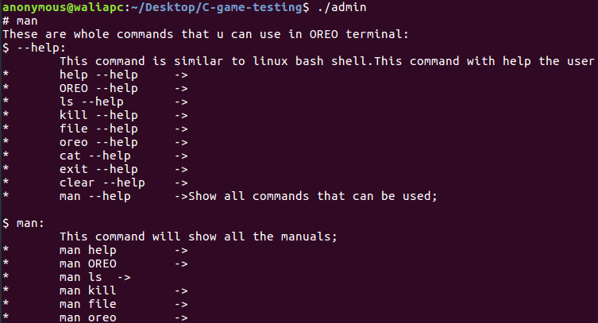

# FORMATTING TEXT

 USED VARIABLE | COLOR CODE  FOR C/C++ | COLOR CODE FOR JAVA | OUTPUT
---------------|-----------------------|---------------------|--------
 RESET | \x1B[0m | \u001B[0m | [RESET NORMAL](#rocket-RESET)
 BOLD | \x1B[1m | \u001B[1m | [BOLD WHITE](#rocket-BOLD)
 ITALIC | \x1B[3m | \u001B[3m | [ITALIC TEXT](#rocket-ITALIC)
 UNDERLINE | \x1B[4m | \u001B[4m | [UNDERLINE TEXT](#rocket-UNDERLINE)

## OUTPUT

### :rocket: RESET

### :rocket: BOLD

### :rocket: ITALIC

### :rocket: UNDERLINE

