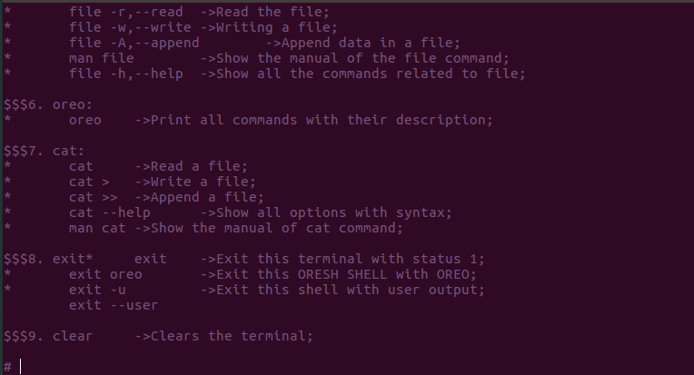

# TEXT COLORS

 USED VARIABLE | COLOR CODE | OUTPUT COLOR
---------------|------------|--------------
 DGREEN | "\x1B[2m" | [DARK GREEN](#rocket-DGREEN)
 BLACK | "\x1B[30m" | [BLACK](#rocket-BLACK)
 RED | "\x1B[31m" | [RED](#rocket-RED)
 LGREEN | "\x1B[32m" | [LIGHT GREEN](#rocket-LGREEN)
 YELLOW | "\x1B[33m" | [YELLOW](#rocket-YELLOW)
 BLUE | "\x1B[34m" | [BLUE](#rocket-BLUE)
 MAGENTA | "\x1B[35m" | [MAGENTA](#rocket-MAGENTA)
 CYAN | "\x1B[36m" | [CYAN](#rocket-CYAN)
 WHITE | "\x1B[37m" | [WHITE](#rocket-WHITE)

## OUTPUT

### :rocket: DGREEN

### :rocket: BLACK

### :rocket: RED

### :rocket: LGREEN

### :rocket: YELLOW

### :rocket: BLUE

### :rocket: MAGENTA

### :rocket: CYAN

### :rocket: WHITE

